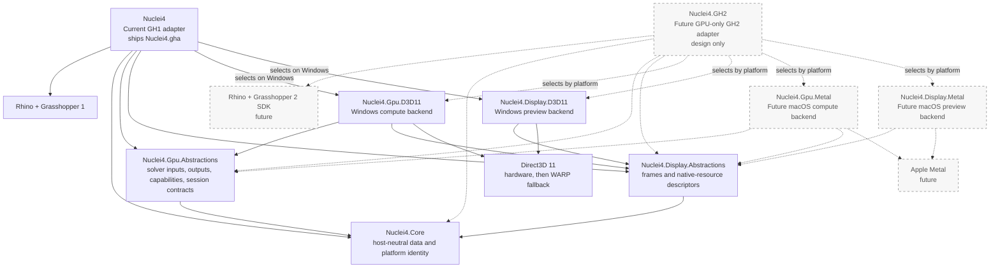
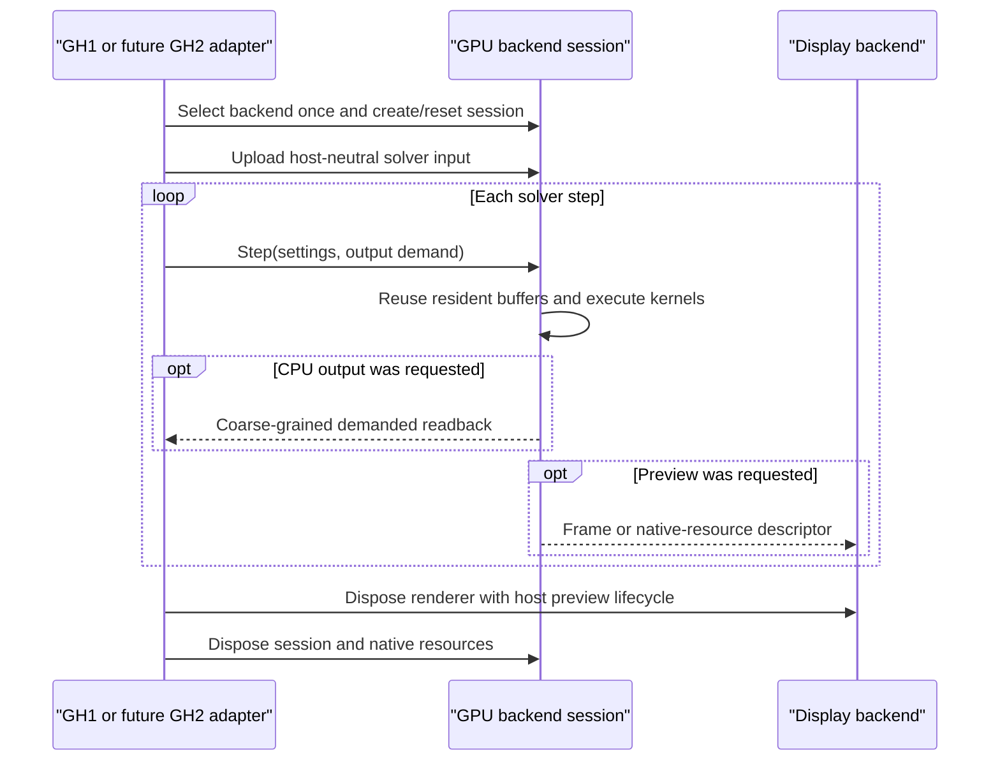

# Nuclei V4 Architecture

V4 is a GPU-first product with one shared architecture and thin Grasshopper
adapters. The currently shipped adapter remains GH1. GH2 and macOS Metal are
planned extension points; neither is implemented or shipped by this split.

The product namespace remains `Nuclei4`. Existing GH1 component identities,
public model/Goo types, archive schemas, shader contracts, and the
`Nuclei4.gha` assembly remain compatibility boundaries.

## Dependency graph

Arrows mean "depends on". Dashed nodes are future design targets.

`Nuclei4.Core` and both abstraction assemblies must remain independent of
Grasshopper, Rhino UI, Direct3D, and Metal. Concrete backends may depend on
abstractions, never the reverse. A host adapter is the composition root: it
chooses a concrete backend and translates host objects at the boundary.

The compute backend may publish preview frames or native-resource descriptors
through `Nuclei4.Display.Abstractions`. It must not reference a concrete display
backend. A descriptor identifies its backend, interop kind, device, and native
handle; it must not assume that every resource is a DXGI shared texture.

## Runtime lifecycle

Ownership is intentionally simple:

- The Grasshopper adapter owns components, document events, host-object
  translation, output sinks, backend selection, reset, and disposal.
- A GPU session owns its device context, buffers, compiled shaders, staging
  resources, solver state, and iteration state.
- A display backend owns renderer and interop resources for its platform.
- Core inputs and output views contain neutral values and arrays; they do not
  own Grasshopper objects or platform-native resources.

Fast reset should reuse the same compatible session. A hard reset recreates
resources only when dimensions, capacity, device, or another allocation contract
changes. Backend selection and capability discovery are not per-step work.

## Performance rules

- Keep particle, voxel, trail, density, and mesh state GPU-resident.
- Use a few coarse backend/output calls per step; never dispatch through an
  interface per particle or voxel.
- Do not introduce mandatory GPU-to-CPU copies. Read back only outputs demanded
  by the Grasshopper graph, including paused extraction behavior.
- Reuse arrays, buffers, views, command resources, and renderer resources during
  steady-state execution. Avoid new per-step allocations.
- Preserve shader binaries, buffer layouts, dispatch order, hardware-to-WARP
  fallback, reset behavior, and existing error cleanup.
- Compare steady-state medians against the immutable baseline. A regression over
  5% fails the preservation contract and must be investigated before release.

## Adapter rules

The GH1 project remains the compatibility assembly and keeps the existing public
types whose assembly-qualified identity is part of saved Grasshopper documents.
It translates those types into host-neutral GPU input and applies demanded output
through a coarse output sink. The architecture split must not change component
GUIDs, names, parameters, defaults, archive keys, menu state, or output behavior.

The future GH2 project is a separate, GPU-only adapter. It will translate GH2 SDK
types into the same neutral contracts and select the available platform backend.
It must not duplicate solver kernels or make the shared layers depend on GH2.
GH1 remains supported alongside it.

## Migration status

- **Current shipping host:** GH1 through `Nuclei4.gha`.
- **Current executable platform backend:** Direct3D 11 compute and display on
  Windows, retaining hardware-device creation followed by WARP fallback.
- **Implemented by this split:** `Nuclei4.Core`, GPU abstractions and D3D11
  backend, display abstractions and D3D11 backend, and a coarse GH1 output sink.
  The main `Nuclei4.gha` remains the GH1 compatibility/composition assembly.
- **Not implemented now:** a GH2 SDK adapter, Metal compute, Metal display, and
  macOS packaging. Their boundaries are reserved so these can be added without
  rewriting solver behavior or changing the GH1 compatibility surface.

The executable compatibility and performance gates are defined in
`docs/V4_PRESERVATION_CONTRACT.md`.

## Verified split result

- Rhino 7 (`net48`) and Rhino 8/9 (`net7.0-windows`) Release builds pass with
  zero errors.
- All 28 frozen preservation contracts pass: assembly/GH identities, 52 public
  types and 732 API records, 39 component schemas, 41 GUIDs, all resources,
  all 24 shader binaries, both constant-buffer layouts, and clean deployment.
- D3D11 initialization, reset, density preview, live wrap, and demanded output
  smoke tests pass on the current hardware backend.
- Five sustained synchronized benchmark runs used 262,144 particles and
  262,144 voxels. Baseline median-of-medians was 3.530 ms; the split result was
  3.562 ms (+0.91%), well inside the 5% preservation gate.
