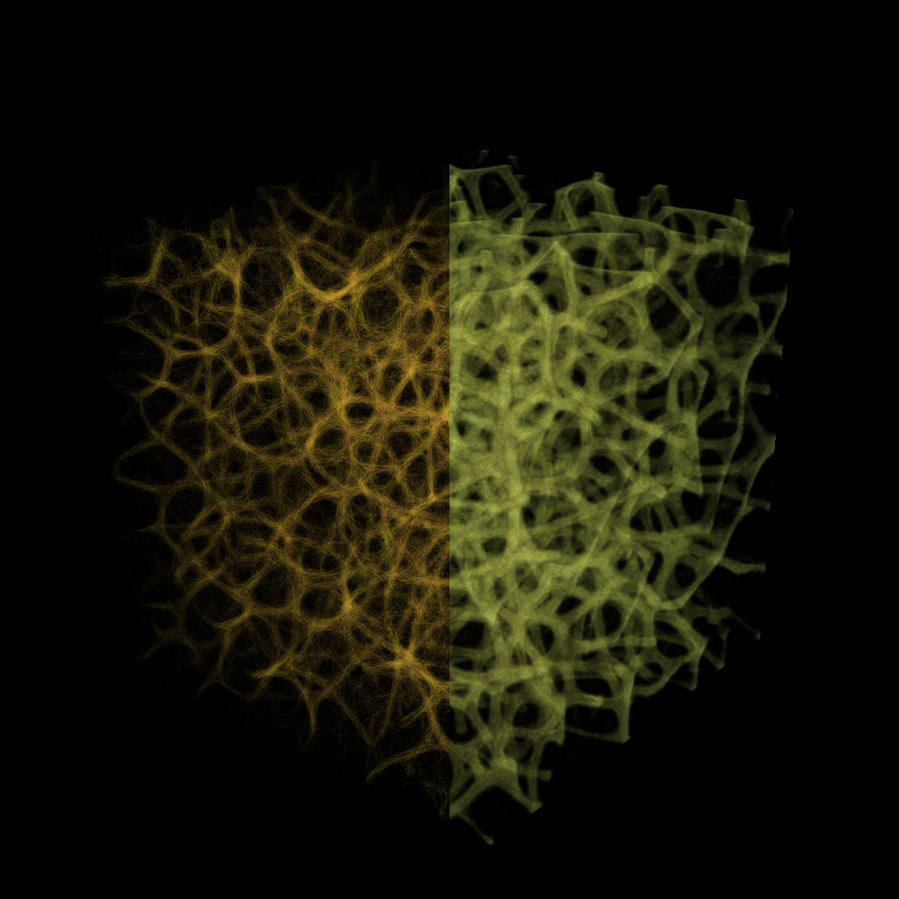

# Welcome to Nuclei

**Grow networks and patterns in Grasshopper.**

Nuclei is a generative-design plugin that lets you explore how simple particle behaviors create complex forms. Particles sense their surroundings, move through a voxel field, and leave signals that guide other particles. Over time, those interactions can produce branching networks, connected paths, and volumetric patterns.

## What can you make?

Use **slime simulations** to explore self-organizing networks. Particles follow a shared signal and reinforce paths as they move.

Use **ant simulations** to explore foraging systems. Ants search for food, carry it home, and leave pheromone trails that guide later journeys.

Shape either simulation with **voxel fields**: the cells that describe its environment. Fields can carry values that influence movement and sensing. Nuclei includes tools for mapping these values, previewing the simulation, and extracting results for further work in Grasshopper.

## Start here

1. [Check installation and compatibility](installation.md).

2. [Build your first slime simulation](getting-started/first-slime-simulation.md).

3. [Follow your first ant simulation.](getting-started/first-ant-simulation.md)
4. [Explore the V4 example collection.](examples/README.md)

You should be comfortable placing Grasshopper components, connecting wires, and using number sliders and Boolean Toggles. No programming is required.

## About this guide

This guide teaches **Nuclei V4**, the GPU version for **Rhino 9 on Windows**. Use components from the **Nuclei4** tab when following the tutorials. Older Nuclei versions have different capabilities and component layouts.

Nuclei is developed by **Madalin Gheorghe**. Find downloads on [Food4Rhino](https://www.food4rhino.com/en/app/nuclei), or [report a problem on GitHub](https://github.com/madalin-gheorghe/Nuclei/issues).
