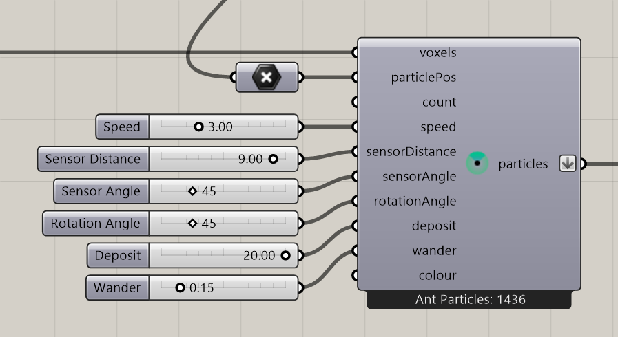

# Construct Ant Particles

Create ants that search for food and return to their starting colony.

**Location:** Nuclei4 → Particles



## Use it

Connect a voxel field and supply **Initial Particle Positions** in the nest region. These points define where ants start and remember home. The constructor has no Particle Count input; the supplied points determine the starting population.

Connect **particles** to the solver, and use [Define Voxel Values](define-voxel-values.md) to add **Ant Food** to the environment. Preview the solver output to follow the moving ants.

## Inputs

Defaults describe a newly placed component.

| Input | Type / access | Default | Meaning |
| --- | --- | --- | --- |
| **Voxel Field** (`voxels`) | Generic Data / item | Required | Field containing the nest and starting positions. |
| **Initial Particle Positions** (`particlePos`) | Point / list | Required | Starting points in the nest region and remembered home locations. |
| **Speed** (`speed`) | Number / item | 1.3 | Movement distance per step in model units, before local mapping. |
| **Sensor Distance** (`sensorDistance`) | Number / item | 6 | Sensing distance in model units, before local mapping. |
| **Sensor Angle** (`sensorAngle`) | Number / item | 45 | Sensing angle in degrees. |
| **Rotation Angle** (`rotationAngle`) | Number / item | 45 | Steering angle in degrees. |
| **Deposit** (`deposit`) | Number / item | 1 | Pheromone deposited by particles. |
| **Wander** (`wander`) | Number / item | 0 | Random-turn control, from 0 to 1. |
| **Colour** (`colour`) | Colour / item | Optional; 66,236,122 (125) | Population display color. |

## Output

| Output | Type / access | Meaning |
| --- | --- | --- |
| **Output Particle Group** (`particles`) | Particle Group / item | Starting ant population and its shared settings. |

## Starting the colony

Place starting points inside the nest region, using voxel centers or a selection of points. Each accepted point creates an ant. Without starting points, the constructor does not create ants. Points outside the field or inside blocked cells are skipped.

The population after reset can be smaller than the supplied point list because the solver also checks boundaries and occupied cells. Use distinct eligible voxels within the nest region.

## If something is wrong

| Symptom | Action |
| --- | --- |
| No particles | Connect starting points inside the nest region and check that its voxels are usable. |
| Ants do not find food | Check the Ant Food map and the field entering the solver. |

## Continue

[Ants Intro — 3D](../examples/13-ants-intro-3d.md) · [Ants Intro](../examples/13-ants-intro.md) · [Ants Complex](../examples/14-ants-complex.md) · [Component reference](README.md)

<details>
<summary>Machine-readable reference (JSON)</summary>

[Download JSON](../reference/components/construct-ant-particles.json) · [JSON Schema](../reference/component.schema.json) · [How to read this JSON](../reference/reading-json.md)

Component metadata for scripts and AI tools. Indices are zero-based; defaults are display strings. [Full catalog](../reference/component-contracts.json).

```json
{
  "$schema": "../component.schema.json",
  "schemaVersion": 1,
  "pluginVersion": "4.1.0.0",
  "ghaSha256": "700C1620FD839DD1511E67359961787C8EC08EA595812B2EDED27828F96800C5",
  "component": {
    "name": "Construct Ant Particles",
    "category": "Nuclei4",
    "subcategory": " Particles",
    "componentGuid": "3eab04d8-68ed-476d-b33d-a8633418ab12",
    "dotnetType": "Nuclei4.ParticleGroup_Constructor_Ant",
    "inputs": [
      {
        "index": 0,
        "name": "Voxel Field",
        "nickname": "voxels",
        "ghType": "Generic Data",
        "access": "item",
        "optional": false,
        "mapping": "None",
        "defaults": []
      },
      {
        "index": 1,
        "name": "Initial Particle Positions",
        "nickname": "particlePos",
        "ghType": "Point",
        "access": "list",
        "optional": false,
        "mapping": "None",
        "defaults": []
      },
      {
        "index": 2,
        "name": "Speed",
        "nickname": "speed",
        "ghType": "Number",
        "access": "item",
        "optional": false,
        "mapping": "None",
        "defaults": [
          "1.3"
        ]
      },
      {
        "index": 3,
        "name": "Sensor Distance",
        "nickname": "sensorDistance",
        "ghType": "Number",
        "access": "item",
        "optional": false,
        "mapping": "None",
        "defaults": [
          "6"
        ]
      },
      {
        "index": 4,
        "name": "Sensor Angle",
        "nickname": "sensorAngle",
        "ghType": "Number",
        "access": "item",
        "optional": false,
        "mapping": "None",
        "defaults": [
          "45"
        ]
      },
      {
        "index": 5,
        "name": "Rotation Angle",
        "nickname": "rotationAngle",
        "ghType": "Number",
        "access": "item",
        "optional": false,
        "mapping": "None",
        "defaults": [
          "45"
        ]
      },
      {
        "index": 6,
        "name": "Deposit",
        "nickname": "deposit",
        "ghType": "Number",
        "access": "item",
        "optional": false,
        "mapping": "None",
        "defaults": [
          "1"
        ]
      },
      {
        "index": 7,
        "name": "Wander",
        "nickname": "wander",
        "ghType": "Number",
        "access": "item",
        "optional": false,
        "mapping": "None",
        "defaults": [
          "0"
        ]
      },
      {
        "index": 8,
        "name": "Colour",
        "nickname": "colour",
        "ghType": "Colour",
        "access": "item",
        "optional": true,
        "mapping": "None",
        "defaults": [
          "66,236,122 (125)"
        ]
      }
    ],
    "outputs": [
      {
        "index": 0,
        "name": "Output Particle Group",
        "nickname": "particles",
        "ghType": "Particle Group",
        "access": "item",
        "optional": false,
        "mapping": "Flatten",
        "defaults": []
      }
    ]
  }
}
```

</details>
