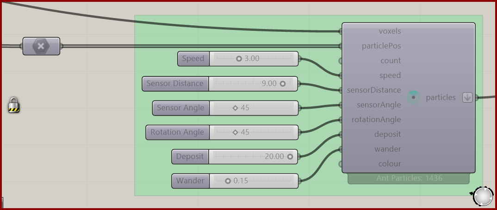

# Construct Ant Particles

Create an ant population with shared movement and sensing settings. Ants search for food and return to their remembered home positions.

**Location:** Nuclei4 → Particles

*Captured from 13_Ants Intro_3D.gh, preserving its component position and connected controls. Example values can differ from the fresh-component defaults below.*

## Use it

Connect the field and either supply starting positions or a positive count for generated positions. Explicit positions let you organize the starting colony. Connect the particle group to the solver and provide Ant Food in the environment. Keep food and pheromone Types distinct.

## Inputs

| Input | Data | Default | Purpose |
| --- | --- | --- | --- |
| **Voxel Field** (`voxels`) | Generic Data; item | Supply input | Voxel field used for internal particle generation |
| **Initial Particle Positions** (`particlePos`) | Point; list | Optional | Initial Particle Positions |
| **Particle Count** (`count`) | Integer; item | 0 | Number of particles to generate at random voxel centers when no initial positions are supplied |
| **Speed** (`speed`) | Number; item | 1.3 | Speed of particle movement |
| **Sensor Distance** (`sensorDistance`) | Number; item | 6 | Maximum distance for sensing surrounding voxel values |
| **Sensor Angle** (`sensorAngle`) | Number; item | 45 | Angle of sensing surrounding voxel values |
| **Rotation Angle** (`rotationAngle`) | Number; item | 45 | Angle of rotation for the particles |
| **Deposit** (`deposit`) | Number; item | 1 | The Amount of Chemoattractants Each Particle Deposits in the Environment |
| **Wander** (`wander`) | Number; item | 0 | The Frequency of Random Directions. VALUES FROM 0 TO 1. The Larger the Value the More Chaotic |
| **Colour** (`colour`) | Colour; item | 66,236,122 (125) | The Display Color of The Particles |

Defaults describe a newly placed component. A saved definition can store other values on an unconnected input.

## Outputs

| Output | Data | Purpose |
| --- | --- | --- |
| **Output Particle Group** (`particles`) | Particle Group; item | OutputParticles |

## In the example collection

- [13_Ants Intro_3D](../examples/13-ants-intro-3d.md)
- [13_Ants Intro](../examples/13-ants-intro.md)
- [14_Ants Complex](../examples/14-ants-complex.md)

[Back to the component reference](README.md)
