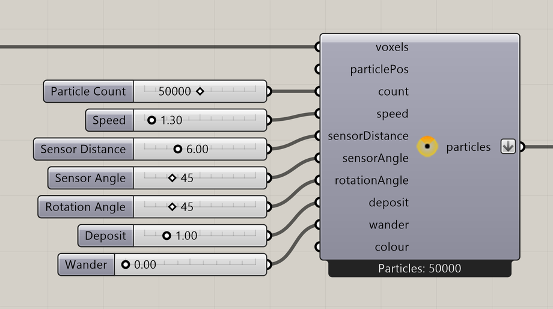

# Construct Slime Particles

Create a starting slime population with shared movement, sensing, deposit, and display settings.

**Location:** Nuclei4 → Particles



## Use it

Connect a field, then supply starting points or a positive **Particle Count**. The fresh count is **0**: a new component does not automatically populate the field.

Connect **particles** to the solver. Connect previews and extractors to the **solver's** output to follow moving particles.

## Inputs

Defaults describe a newly placed component; saved inputs can differ.

| Input | Type / access | Default | Meaning |
| --- | --- | --- | --- |
| **Voxel Field** (`voxels`) | Generic Data / item | Required | Field used to generate and validate starting positions. |
| **Initial Particle Positions** (`particlePos`) | Point / list | Optional; empty | Explicit points. A nonempty list takes precedence over Count. |
| **Particle Count** (`count`) | Integer / item | 0 | Requested generated population when no points are supplied. Negative counts become 0. |
| **Speed** (`speed`) | Number / item | 1.3 | Intended movement per step in model units, before a local speed multiplier. |
| **Sensor Distance** (`sensorDistance`) | Number / item | 6 | Sensing distance in model units, before a local sensing multiplier. |
| **Sensor Angle** (`sensorAngle`) | Number / item | 45 | Degrees; fractional values are rounded down to an integer. |
| **Rotation Angle** (`rotationAngle`) | Number / item | 45 | Steering degrees; fractional values are rounded down to an integer. |
| **Deposit** (`deposit`) | Number / item | 1 | Signal added after movement into a different voxel. |
| **Wander** (`wander`) | Number / item | 0 | Random-turn control from 0 to 1. Zero disables it; this is not a percentage per second. |
| **Colour** (`colour`) | Colour / item | Optional; RGB 220,255,0; alpha 125 | Population display color. Alpha uses the 0–255 scale. |

## Output

| Output | Type / access | Meaning |
| --- | --- | --- |
| **Output Particle Group** (`particles`) | Particle Group / item | Starting particles and their shared settings. The output parameter flattens its data. |

## Requested and retained particles

Generated positions are scattered inside eligible cells, not restricted to exact centers. Generation uses at most one starting particle per eligible cell and caps the generated count to available cells.

When you supply points, Count is ignored. Out-of-field, non-finite, blocked, and excluded positions are skipped. A nonempty point list with no eligible positions does not fall back to generated particles.

The solver applies additional reset rules, including boundaries and exclusive voxel occupancy. Several points in one cell do not guarantee several retained particles. In the original Slime Intro test, the constructor produced **50,000**, and default reflective boundaries left **49,801** in the simulation. Distinguish requested, generated, and retained counts.

## If something is wrong

| Symptom | Action |
| --- | --- |
| `Particles: 0` | Check Count, supplied points, field connection, and eligible cells. |
| Changing Count does nothing | Check whether Initial Particle Positions contains points. |
| Output appears stationary | Preview the solver output, set Reset False, and run its Trigger. |
| Fractional angles behave unexpectedly | Use whole degrees; 45.9 becomes 45. |
| Fewer particles survive reset | Inspect boundaries, blocked cells, and several points sharing one cell. |

## Continue

[Slime Intro](../getting-started/first-slime-simulation.md) · [Slime behavior](../core-concepts/slime-behavior.md) · [Define Voxel Values](define-voxel-values.md) · [Component reference](README.md)

<details>
<summary>Machine-readable reference (JSON)</summary>

Runtime output: `Nuclei4.ParticleGroup`, carried by the Particle Group parameter.

Component metadata for scripts and AI tools. Indices are zero-based; defaults are display strings. This describes the component, not an executable API. [Full catalog](../reference/component-contracts.json).

```json
{
  "schemaVersion": 1,
  "pluginVersion": "4.1.0.0",
  "ghaSha256": "700C1620FD839DD1511E67359961787C8EC08EA595812B2EDED27828F96800C5",
  "component": {
    "name": "Construct Slime Particles",
    "category": "Nuclei4",
    "subcategory": " Particles",
    "componentGuid": "24ede5e7-2957-4f98-8f83-80c6f5dfd31f",
    "dotnetType": "Nuclei4.ParticleGroup_Constructor_Slime",
    "inputs": [
      {
        "index": 0,
        "name": "Voxel Field",
        "nickname": "voxels",
        "ghType": "Generic Data",
        "access": "item",
        "optional": false,
        "mapping": "None",
        "defaults": []
      },
      {
        "index": 1,
        "name": "Initial Particle Positions",
        "nickname": "particlePos",
        "ghType": "Point",
        "access": "list",
        "optional": true,
        "mapping": "None",
        "defaults": []
      },
      {
        "index": 2,
        "name": "Particle Count",
        "nickname": "count",
        "ghType": "Integer",
        "access": "item",
        "optional": false,
        "mapping": "None",
        "defaults": [
          "0"
        ]
      },
      {
        "index": 3,
        "name": "Speed",
        "nickname": "speed",
        "ghType": "Number",
        "access": "item",
        "optional": false,
        "mapping": "None",
        "defaults": [
          "1.3"
        ]
      },
      {
        "index": 4,
        "name": "Sensor Distance",
        "nickname": "sensorDistance",
        "ghType": "Number",
        "access": "item",
        "optional": false,
        "mapping": "None",
        "defaults": [
          "6"
        ]
      },
      {
        "index": 5,
        "name": "Sensor Angle",
        "nickname": "sensorAngle",
        "ghType": "Number",
        "access": "item",
        "optional": false,
        "mapping": "None",
        "defaults": [
          "45"
        ]
      },
      {
        "index": 6,
        "name": "Rotation Angle",
        "nickname": "rotationAngle",
        "ghType": "Number",
        "access": "item",
        "optional": false,
        "mapping": "None",
        "defaults": [
          "45"
        ]
      },
      {
        "index": 7,
        "name": "Deposit",
        "nickname": "deposit",
        "ghType": "Number",
        "access": "item",
        "optional": false,
        "mapping": "None",
        "defaults": [
          "1"
        ]
      },
      {
        "index": 8,
        "name": "Wander",
        "nickname": "wander",
        "ghType": "Number",
        "access": "item",
        "optional": false,
        "mapping": "None",
        "defaults": [
          "0"
        ]
      },
      {
        "index": 9,
        "name": "Colour",
        "nickname": "colour",
        "ghType": "Colour",
        "access": "item",
        "optional": true,
        "mapping": "None",
        "defaults": [
          "220,255,0 (125)"
        ]
      }
    ],
    "outputs": [
      {
        "index": 0,
        "name": "Output Particle Group",
        "nickname": "particles",
        "ghType": "Particle Group",
        "access": "item",
        "optional": false,
        "mapping": "Flatten",
        "defaults": []
      }
    ]
  }
}
```

</details>
