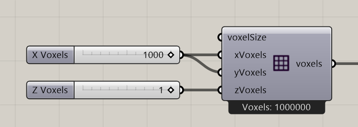

# Construct Voxels

Create the simulation’s voxel domain from a cell size and three cell counts.

**Location:** Nuclei4 → Environment

## Use it

Keep Z at one for an XY plane. Connect this same environment to particle generation and the solver. Only one Construct Voxels instance is allowed per Grasshopper document. Begin with manageable dimensions before increasing 3D resolution.

## Inputs

| Input | Data | Default | Purpose |
| --- | --- | --- | --- |
| **Voxel Size** (`voxelSize`) | Number; item | 1 | Size of one voxel in x,y,z |
| **X Voxels** (`xVoxels`) | Integer; item | 100 | Number of voxels in X |
| **Y Voxels** (`yVoxels`) | Integer; item | 100 | Number of voxels in Y |
| **Z Voxels** (`zVoxels`) | Integer; item | 1 | Number of voxels in Z |

Defaults describe a newly placed component. A saved definition can store other values on an unconnected input.

## Outputs

| Output | Data | Purpose |
| --- | --- | --- |
| **Output Voxels** (`voxels`) | Generic Data; item | Output Voxels |

## In the example collection

- [01_Slime Intro](../examples/01-slime-intro.md)
- [02_Gradient Map](../examples/02-gradient-map.md)
- [03_Minimizing Transport Networks 1](../examples/03-minimizing-transport-networks-1.md)

[Back to the component reference](README.md)
