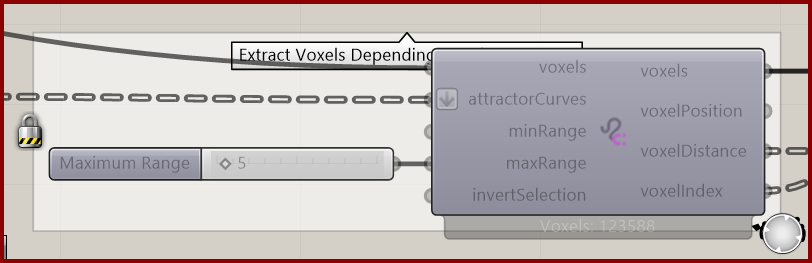

# Curve Attractor for Voxels

Select voxels within a distance band around curves.

**Location:** Nuclei4 → Environment

*Captured from 06_Attractor Curves 1.gh, preserving its component position and connected controls. Example values can differ from the fresh-component defaults below.*

## Use it

Connect the original curves and field, set the minimum and maximum ranges, then assign values to the selected cells. Ranges are in model units. Thin bands are rasterized onto the grid, so their visible thickness depends on voxel size.

## Inputs

| Input | Data | Default | Purpose |
| --- | --- | --- | --- |
| **Voxels** (`voxels`) | Generic Data; item | Supply input | Connects to Voxel Constructor |
| **Attractor Curves** (`attractorCurves`) | Curve; list | Supply input | Attractor Curves |
| **Minimum Range** (`minRange`) | Number; item | 0 | Minimum distance in model units. Supplied reversed ranges are sorted. Thin walls retain neighboring voxels bracketing the wall; rasterized centers can extend beyond the requested interval. |
| **Maximum Range** (`maxRange`) | Number; item | 1 | Maximum distance in model units. An omitted maximum grows from minRange if needed. Range width is at least one voxel size; thin walls additionally retain bracketing voxel pairs for at least two neighboring layers total, subject to available input voxels. |
| **Invert Voxel Selection** (`invertSelection`) | Boolean; item | False | Inverts the Voxel Selection |

Defaults describe a newly placed component. A saved definition can store other values on an unconnected input.

## Outputs

| Output | Data | Purpose |
| --- | --- | --- |
| **Output Voxels** (`voxels`) | Generic Data; item | Output Voxels |
| **Output Voxel Positions** (`voxelPosition`) | Point; list | Output Voxel Positions |
| **Output Distances to Voxels** (`voxelDistance`) | Number; list | Output Distances from Attractor to Voxel |
| **Output Voxel Indices** (`voxelIndex`) | Integer; list | Output Voxel Indices for Sorting |

## In the example collection

- [06_Attractor Curves 1](../examples/06-attractor-curves-1.md)
- [07_Attractor Curves 2](../examples/07-attractor-curves-2.md)
- [14_Ants Complex](../examples/14-ants-complex.md)

[Back to the component reference](README.md)
