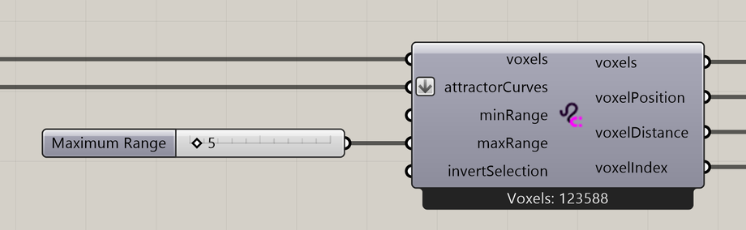

# Curve Attractor for Voxels

Select voxels along curves.

**Location:** Nuclei4 → Environment



## Use it

Connect a field to **voxels** and curves to **attractorCurves**. Set the minimum and maximum distances from the curves to select voxels, then pass the selected **voxels** into a mapping component.

Use **voxelDistance** when the mapped value should vary with distance from a curve.

## Inputs

Defaults describe a newly placed component.

| Input | Type / access | Default | Meaning |
| --- | --- | --- | --- |
| **Voxels** (`voxels`) | Generic Data / item | Required | Voxel field or selection to use. |
| **Attractor Curves** (`attractorCurves`) | Curve / list | Required | Curves defining the selected regions. |
| **Minimum Range** (`minRange`) | Number / item | 0 | Minimum distance from the attractor, in model units. |
| **Maximum Range** (`maxRange`) | Number / item | 1 | Maximum distance from the attractor, in model units. |
| **Invert Voxel Selection** (`invertSelection`) | Boolean / item | False | Keep the other cells of the input field instead. |

## Outputs

| Output | Type / access | Meaning |
| --- | --- | --- |
| **Output Voxels** (`voxels`) | Generic Data / item | Selected or modified voxel field. |
| **Output Voxel Positions** (`voxelPosition`) | Point / tree | Centers of the selected voxels. |
| **Output Distances to Voxels** (`voxelDistance`) | Number / tree | Distances paired with the selected voxel centers. |
| **Output Voxel Indices** (`voxelIndex`) | Integer / tree | Indices of the selected voxels, paired with the position output. |

## Distance and resolution

**Minimum Range** and **Maximum Range** set how close to and how far from the curves voxels are selected, measured in Rhino model units. The selection follows the voxel resolution, so its boundary may extend beyond the exact requested distance. **Invert Voxel Selection** keeps the other input cells.

Position, distance, and index outputs use matching branches. Keep them together when assigning values from the distances.

## If something is wrong

| Symptom | Action |
| --- | --- |
| No selected voxels | Check the curve location and the range. |
| Mapped gradient is misaligned | Keep the distance values in the same order as the selected voxels. |

## Continue

[Attractor Curves 1](../examples/06-attractor-curves-1.md) · [Attractor Curves 2](../examples/07-attractor-curves-2.md) · [Ants Complex](../examples/14-ants-complex.md) · [Component reference](README.md)

<details>
<summary>Machine-readable reference (JSON)</summary>

[Download JSON](../reference/components/curve-attractor-for-voxels.json) · [JSON Schema](../reference/component.schema.json) · [How to read this JSON](../reference/reading-json.md)

Component metadata for scripts and AI tools. Indices are zero-based; defaults are display strings. [Full catalog](../reference/component-contracts.json).

```json
{
  "$schema": "../component.schema.json",
  "schemaVersion": 1,
  "pluginVersion": "4.1.0.0",
  "ghaSha256": "700C1620FD839DD1511E67359961787C8EC08EA595812B2EDED27828F96800C5",
  "component": {
    "name": "Curve Attractor for Voxels",
    "category": "Nuclei4",
    "subcategory": " Environment",
    "componentGuid": "59741edd-30fb-42a7-93cb-26f7dee3e03b",
    "dotnetType": "Nuclei4.Voxel_Attractor_Curve",
    "inputs": [
      {
        "index": 0,
        "name": "Voxels",
        "nickname": "voxels",
        "ghType": "Generic Data",
        "access": "item",
        "optional": false,
        "mapping": "None",
        "defaults": []
      },
      {
        "index": 1,
        "name": "Attractor Curves",
        "nickname": "attractorCurves",
        "ghType": "Curve",
        "access": "list",
        "optional": false,
        "mapping": "Flatten",
        "defaults": []
      },
      {
        "index": 2,
        "name": "Minimum Range",
        "nickname": "minRange",
        "ghType": "Number",
        "access": "item",
        "optional": false,
        "mapping": "None",
        "defaults": [
          "0"
        ]
      },
      {
        "index": 3,
        "name": "Maximum Range",
        "nickname": "maxRange",
        "ghType": "Number",
        "access": "item",
        "optional": false,
        "mapping": "None",
        "defaults": [
          "1"
        ]
      },
      {
        "index": 4,
        "name": "Invert Voxel Selection",
        "nickname": "invertSelection",
        "ghType": "Boolean",
        "access": "item",
        "optional": false,
        "mapping": "None",
        "defaults": [
          "False"
        ]
      }
    ],
    "outputs": [
      {
        "index": 0,
        "name": "Output Voxels",
        "nickname": "voxels",
        "ghType": "Generic Data",
        "access": "item",
        "optional": false,
        "mapping": "None",
        "defaults": []
      },
      {
        "index": 1,
        "name": "Output Voxel Positions",
        "nickname": "voxelPosition",
        "ghType": "Point",
        "access": "list",
        "optional": false,
        "mapping": "None",
        "defaults": []
      },
      {
        "index": 2,
        "name": "Output Distances to Voxels",
        "nickname": "voxelDistance",
        "ghType": "Number",
        "access": "list",
        "optional": false,
        "mapping": "None",
        "defaults": []
      },
      {
        "index": 3,
        "name": "Output Voxel Indices",
        "nickname": "voxelIndex",
        "ghType": "Integer",
        "access": "list",
        "optional": false,
        "mapping": "None",
        "defaults": []
      }
    ]
  }
}
```

</details>
