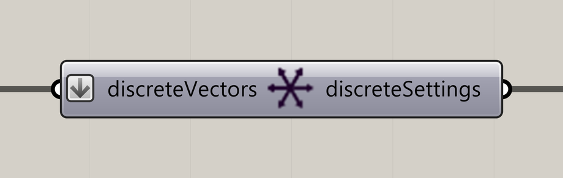

# Define Discrete Vectors

Restrict particle movement to a supplied set of directions.

**Location:** Nuclei4 → Environment



## Use it

Supply direction vectors to **discreteVectors**, then connect **discreteSettings** to the solver’s **settings** input. The component normalizes the supplied vectors.

## Inputs

Defaults describe a newly placed component.

| Input | Type / access | Default | Meaning |
| --- | --- | --- | --- |
| **Voxel Discrete Vectors** (`discreteVectors`) | Vector / list | Required | Direction vectors to normalize and use as movement choices. |

## Output

| Output | Type / access | Meaning |
| --- | --- | --- |
| **Discrete Vector Settings** (`discreteSettings`) | Text / list | Discrete direction settings for the solver. |

## If something is wrong

| Symptom | Action |
| --- | --- |
| Directions are not applied | Check the settings connection and reset the solver. |
| Unexpected movement | Check the supplied vectors and remove zero-length vectors. |

## Continue

[Component reference](README.md)

<details>
<summary>Machine-readable reference (JSON)</summary>

Component metadata for scripts and AI tools. Indices are zero-based; defaults are display strings. [Full catalog](../reference/component-contracts.json).

```json
{
  "schemaVersion": 1,
  "pluginVersion": "4.1.0.0",
  "ghaSha256": "700C1620FD839DD1511E67359961787C8EC08EA595812B2EDED27828F96800C5",
  "component": {
    "name": "Define Discrete Vectors",
    "category": "Nuclei4",
    "subcategory": " Environment",
    "componentGuid": "c4f37772-d03a-44a5-bd50-755442b1c5f3",
    "dotnetType": "Nuclei4.Voxel_Vectors_Discretize",
    "inputs": [
      {
        "index": 0,
        "name": "Voxel Discrete Vectors",
        "nickname": "discreteVectors",
        "ghType": "Vector",
        "access": "list",
        "optional": false,
        "mapping": "Flatten",
        "defaults": []
      }
    ],
    "outputs": [
      {
        "index": 0,
        "name": "Discrete Vector Settings",
        "nickname": "discreteSettings",
        "ghType": "Text",
        "access": "list",
        "optional": false,
        "mapping": "None",
        "defaults": []
      }
    ]
  }
}
```

</details>
