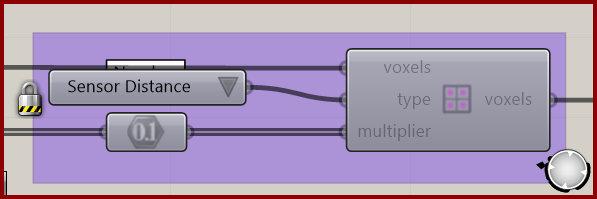

# Define Voxel Values

Assign a selected scalar property to voxels.

**Location:** Nuclei4 → Environment

*Captured from 02_Gradient Map.gh, preserving its component position and connected controls. Example values can differ from the fresh-component defaults below.*

## Use it

Select the named Type, then supply the multiplier values for the selected field. Speed and sensing maps modify particle behavior locally; food fields have their own meaning. Keep data ordering consistent and preview the same Type before running.

## Inputs

| Input | Data | Default | Purpose |
| --- | --- | --- | --- |
| **Voxels** (`voxels`) | Generic Data; item | Supply input | Connects to Voxel Constructor |
| **Type** (`type`) | Integer; item | 0 | Type of Voxel Value |
| **Multiplier Value** (`multiplier`) | Number; tree | Supply input | Value Assigned to Voxel will Multiply the Particle Settings |

Defaults describe a newly placed component. A saved definition can store other values on an unconnected input.

## Outputs

| Output | Data | Purpose |
| --- | --- | --- |
| **Output Voxels** (`voxels`) | Generic Data; item | Output Voxels |

## In the example collection

- [02_Gradient Map](../examples/02-gradient-map.md)
- [03_Minimizing Transport Networks 1](../examples/03-minimizing-transport-networks-1.md)
- [04_Minimizing Transport Networks 2](../examples/04-minimizing-transport-networks-2.md)

[Back to the component reference](README.md)
