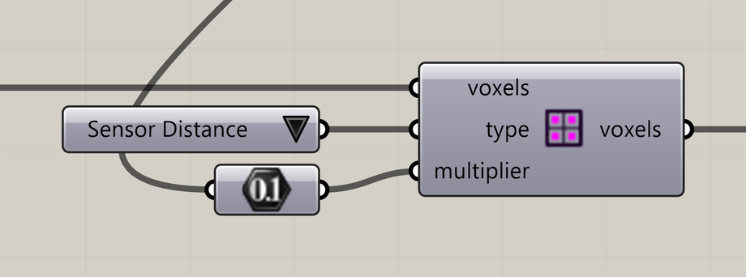

# Define Voxel Values

Assign a scalar map, such as speed, sensing distance, food, or density limits, to a voxel field.

**Location:** Nuclei4 → Environment



## Use it

Connect a voxel field, choose **Type**, and supply **Multiplier Value**. Send the output into the downstream workflow and preview the same property to inspect the map.

For a speed map, use **Type = 2 (Speed)** and **Multiplier Value = 0.5**. Where the map applies, particle Speed 1.3 becomes 0.65 model units of intended movement per step. Food and density limits have their own meanings.

## Inputs and output

Defaults describe a newly placed component.

| Input | Type / access | Default | Meaning |
| --- | --- | --- | --- |
| **Voxels** (`voxels`) | Generic Data / item | Required | One Nuclei field from a constructor, selection, or preceding map. |
| **Type** (`type`) | Integer / item | 0 | Choose from the **Type choices** listed below. A Value List is provided when this input has no source. |
| **Multiplier Value** (`multiplier`) | Number / tree | Required | One value, a full-grid array, or one value per active cell. |

| Output | Type / access | Meaning |
| --- | --- | --- |
| **Output Voxels** (`voxels`) | Generic Data / item | A Nuclei field with the selected scalar map assigned. |

## Type choices

These codes apply to this mapping component. Preview components also offer evolving signals.

| Code | Property | Interpretation |
| --- | --- | --- |
| 0 | Minimum Density | Sets a minimum chemoattractant density, from 0 to 1. A value such as **0.5** can attract particles toward those voxels, as particles seek higher chemoattractant densities. |
| 1 | Maximum Density | Sets a maximum density, from 0 to 1. At **0**, the voxels become obstacles: particles cannot enter them, and they are excluded from simulation computation. |
| 2 | Speed | Multiplies particle Speed. |
| 3 | Sensor Distance | Multiplies particle Sensor Distance. |
| 4 | Sensor Angle | Multiplies particle Sensor Angle. |
| 5 | Rotation Angle | Multiplies particle Rotation Angle. |
| 6 | Slime Food | Stationary food signal for slime. |
| 13 | Ant Food | Food available to ants. |

Minimum and Maximum Density clamp to **0–1**.

## Value count and order

The component reads the whole tree, traverses branches and items in order, and skips null entries.

- **One value:** uses the same value throughout the voxel grid.
- **One value per voxel:** assigns each value to its corresponding voxel for the chosen property.
- **A different number of values:** shows a warning and leaves the existing values unchanged.

If you are working with a voxel selection, you can also supply one value per selected voxel, in selection order.

Full-grid flat index is `x × YCount × ZCount + y × ZCount + z`. For a **2 × 2 × 1** grid:

| Flat index | Cell index `(x,y,z)` | Value from flat list `[10,20,30,40]` |
| --- | --- | --- |
| 0 | (0,0,0) | 10 |
| 1 | (0,1,0) | 20 |
| 2 | (1,0,0) | 30 |
| 3 | (1,1,0) | 40 |

## If something is wrong

| Message or symptom | Action |
| --- | --- |
| `A valid voxel field is required.` | Connect a Nuclei field, rather than extracted geometry. |
| `Multiplier count (3) does not match active voxels (4) or full voxel grid (4). Values were not remapped.` | This tested 2 × 2 × 1 example needs one or four values. |
| Map appears transposed | Check whether input is a flat list or a recognized image-row tree. |
| Map appears unchanged | Check Type on mapping and preview, and connect the mapped output to preview. |

## Continue

[Gradient Map](../examples/02-gradient-map.md) · [Voxels and fields](../core-concepts/voxels-and-fields.md) · [Component reference](README.md)

<details>
<summary>Machine-readable reference (JSON)</summary>

[Download JSON](../reference/components/define-voxel-values.json) · [JSON Schema](../reference/component.schema.json) · [How to read this JSON](../reference/reading-json.md)

Runtime input/output: `Nuclei4.VoxelField`.

Component metadata for scripts and AI tools. Indices are zero-based; defaults are display strings. This describes the component, not an executable API. [Full catalog](../reference/component-contracts.json).

```json
{
  "$schema": "../component.schema.json",
  "schemaVersion": 1,
  "pluginVersion": "4.1.0.0",
  "ghaSha256": "700C1620FD839DD1511E67359961787C8EC08EA595812B2EDED27828F96800C5",
  "component": {
    "name": "Define Voxel Values",
    "category": "Nuclei4",
    "subcategory": " Environment",
    "componentGuid": "6a35ef3b-11f7-4d48-8103-683e82b2dd5d",
    "dotnetType": "Nuclei4.Voxel_Values",
    "inputs": [
      {
        "index": 0,
        "name": "Voxels",
        "nickname": "voxels",
        "ghType": "Generic Data",
        "access": "item",
        "optional": false,
        "mapping": "None",
        "defaults": []
      },
      {
        "index": 1,
        "name": "Type",
        "nickname": "type",
        "ghType": "Integer",
        "access": "item",
        "optional": false,
        "mapping": "None",
        "defaults": [
          "0"
        ]
      },
      {
        "index": 2,
        "name": "Multiplier Value",
        "nickname": "multiplier",
        "ghType": "Number",
        "access": "tree",
        "optional": false,
        "mapping": "None",
        "defaults": []
      }
    ],
    "outputs": [
      {
        "index": 0,
        "name": "Output Voxels",
        "nickname": "voxels",
        "ghType": "Generic Data",
        "access": "item",
        "optional": false,
        "mapping": "None",
        "defaults": []
      }
    ]
  }
}
```

</details>
