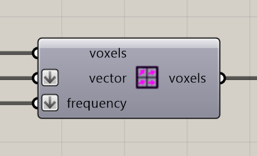

# Define Voxel Vectors

Assign directions to voxels to influence particle movement.

**Location:** Nuclei4 → Environment



## Use it

Connect a field to **voxels** and direction vectors to **vector**. **Frequency** controls how often the mapped directions influence particles; a smaller frequency gives the field more influence.

Send the mapped field to the solver. Use [Extract Voxel Vector](extract-voxel-vector.md) and voxel positions to inspect the directions.

## Inputs

Defaults describe a newly placed component.

| Input | Type / access | Default | Meaning |
| --- | --- | --- | --- |
| **Voxels** (`voxels`) | Generic Data / item | Required | Voxel field or selection to use. |
| **Voxel Vector** (`vector`) | Vector / list | Required | Directions to assign to the field. |
| **Frequency** (`frequency`) | Integer / list | 1 | How often mapped directions influence particles; smaller values increase their influence. |

## Output

| Output | Type / access | Meaning |
| --- | --- | --- |
| **Output Voxels** (`voxels`) | Generic Data / item | Selected or modified voxel field. |

## If something is wrong

| Symptom | Action |
| --- | --- |
| Unexpected directions | Check the vector order against the voxel order. |
| Weak influence on movement | Check Frequency and that the solver receives the mapped field. |

## Continue

[Vector Fields 1](../examples/08-vector-fields-1.md) · [Vector Fields 2](../examples/09-vector-fields-2.md) · [Component reference](README.md)

<details>
<summary>Machine-readable reference (JSON)</summary>

[Download JSON](../reference/components/define-voxel-vectors.json) · [JSON Schema](../reference/component.schema.json) · [How to read this JSON](../reference/reading-json.md)

Component metadata for scripts and AI tools. Indices are zero-based; defaults are display strings. [Full catalog](../reference/component-contracts.json).

```json
{
  "$schema": "../component.schema.json",
  "schemaVersion": 1,
  "pluginVersion": "4.1.0.0",
  "ghaSha256": "700C1620FD839DD1511E67359961787C8EC08EA595812B2EDED27828F96800C5",
  "component": {
    "name": "Define Voxel Vectors",
    "category": "Nuclei4",
    "subcategory": " Environment",
    "componentGuid": "fd6a6fc7-5500-464d-9c1f-94de266ab994",
    "dotnetType": "Nuclei4.Voxel_Vectors",
    "inputs": [
      {
        "index": 0,
        "name": "Voxels",
        "nickname": "voxels",
        "ghType": "Generic Data",
        "access": "item",
        "optional": false,
        "mapping": "None",
        "defaults": []
      },
      {
        "index": 1,
        "name": "Voxel Vector",
        "nickname": "vector",
        "ghType": "Vector",
        "access": "list",
        "optional": false,
        "mapping": "Flatten",
        "defaults": []
      },
      {
        "index": 2,
        "name": "Frequency",
        "nickname": "frequency",
        "ghType": "Integer",
        "access": "list",
        "optional": false,
        "mapping": "Flatten",
        "defaults": [
          "1"
        ]
      }
    ],
    "outputs": [
      {
        "index": 0,
        "name": "Output Voxels",
        "nickname": "voxels",
        "ghType": "Generic Data",
        "access": "item",
        "optional": false,
        "mapping": "None",
        "defaults": []
      }
    ]
  }
}
```

</details>
