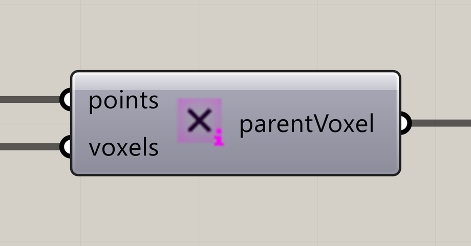

# Extract Parent Voxel

Find the voxel containing each supplied point.

**Location:** Nuclei4 → Utility



## Use it

Connect points to **points** and their field to **voxels**. The output gives the index of each containing voxel within that field or selection.

## Inputs

Defaults describe a newly placed component.

| Input                 | Type / access       | Default  | Meaning                          |
| --------------------- | ------------------- | -------- | -------------------------------- |
| **Points** (`points`) | Point / tree        | Required | Points to locate in the field.   |
| **Voxels** (`voxels`) | Generic Data / item | Required | Voxel field or selection to use. |

## Output

| Output                                 | Type / access | Meaning                                                       |
| -------------------------------------- | ------------- | ------------------------------------------------------------- |
| **Point Parent Voxel** (`parentVoxel`) | Number / tree | Containing voxel index for each point; -1 when none is found. |

## Output branches

The result preserves the input point branches. A value of **-1** means no active voxel was found for that point.

## If something is wrong

| Symptom          | Action                                                                      |
| ---------------- | --------------------------------------------------------------------------- |
| The result is -1 | Check whether the point lies inside an active voxel of the connected field. |

## Continue

[Component reference](./)

<details>

<summary>Machine-readable reference (JSON)</summary>

[Download JSON](../reference/components/extract-parent-voxel.json) · [JSON Schema](../reference/component.schema.json) · [How to read this JSON](../reference/reading-json.md)

Component metadata for scripts and AI tools. Indices are zero-based; defaults are display strings. [Full catalog](../reference/component-contracts.json).

```json
{
  "$schema": "../component.schema.json",
  "schemaVersion": 1,
  "pluginVersion": "4.1.0.0",
  "ghaSha256": "700C1620FD839DD1511E67359961787C8EC08EA595812B2EDED27828F96800C5",
  "component": {
    "name": "Extract Parent Voxel",
    "category": "Nuclei4",
    "subcategory": "Utility",
    "componentGuid": "f4f3534c-1921-448d-b785-dd0854bc8bed",
    "dotnetType": "Nuclei4.Point_Extractor_ParentVoxel",
    "inputs": [
      {
        "index": 0,
        "name": "Points",
        "nickname": "points",
        "ghType": "Point",
        "access": "tree",
        "optional": false,
        "mapping": "None",
        "defaults": []
      },
      {
        "index": 1,
        "name": "Voxels",
        "nickname": "voxels",
        "ghType": "Generic Data",
        "access": "item",
        "optional": false,
        "mapping": "None",
        "defaults": []
      }
    ],
    "outputs": [
      {
        "index": 0,
        "name": "Point Parent Voxel",
        "nickname": "parentVoxel",
        "ghType": "Number",
        "access": "list",
        "optional": false,
        "mapping": "None",
        "defaults": []
      }
    ]
  }
}
```

</details>
