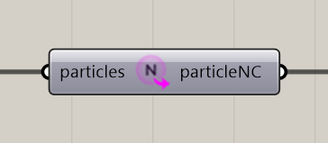

# Extract Particle Neighbour Count

Read each particle’s stored neighbor-count value for analysis in Grasshopper.

**Location:** Nuclei4 → Particles

## Use it

Connect the solver’s particles output. The result reflects particle state; it is not a general-purpose proximity search with an adjustable radius. Pause before inspecting large outputs.

## Inputs

| Input | Data | Default | Purpose |
| --- | --- | --- | --- |
| **Particles** (`particles`) | Generic Data; item | Supply input | Input Particles |

Defaults describe a newly placed component. A saved definition can store other values on an unconnected input.

## Outputs

| Output | Data | Purpose |
| --- | --- | --- |
| **Particle Neighbour Count** (`particleNC`) | Number; list | Particle Neighbour Count |

## Related workflow

Use the input and output roles above with the [voxel-field](../core-concepts/voxels-and-fields.md) or [particle](../core-concepts/particles-and-populations.md) workflow.

[Back to the component reference](README.md)
