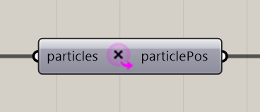

# Extract Particle Positions

Extract current particle positions as Rhino points.

**Location:** Nuclei4 → Particles



## Use it

Connect the solver’s **particles** output. Use **particlePos** wherever Grasshopper needs point geometry.

## Inputs

Defaults describe a newly placed component.

| Input | Type / access | Default | Meaning |
| --- | --- | --- | --- |
| **Particles** (`particles`) | Generic Data / item | Required | Current particle collection from the solver. |

## Output

| Output | Type / access | Meaning |
| --- | --- | --- |
| **Particle Positions** (`particlePos`) | Point / tree | Current positions, grouped by particle population. |

## Output branches

Points are grouped into branches by particle group. Keep those branches when working with several populations.

## If something is wrong

| Symptom | Action |
| --- | --- |
| Points do not move | Check that the input comes from the solver, rather than the constructor. |

## Continue

[Component reference](README.md)

<details>
<summary>Machine-readable reference (JSON)</summary>

[Download JSON](../reference/components/extract-particle-positions.json) · [JSON Schema](../reference/component.schema.json) · [How to read this JSON](../reference/reading-json.md)

Component metadata for scripts and AI tools. Indices are zero-based; defaults are display strings. [Full catalog](../reference/component-contracts.json).

```json
{
  "$schema": "../component.schema.json",
  "schemaVersion": 1,
  "pluginVersion": "4.1.0.0",
  "ghaSha256": "700C1620FD839DD1511E67359961787C8EC08EA595812B2EDED27828F96800C5",
  "component": {
    "name": "Extract Particle Positions",
    "category": "Nuclei4",
    "subcategory": " Particles",
    "componentGuid": "f11f6319-1d69-4c97-8734-17c3f6a13b4a",
    "dotnetType": "Nuclei4.Particle_Extractor_Point",
    "inputs": [
      {
        "index": 0,
        "name": "Particles",
        "nickname": "particles",
        "ghType": "Generic Data",
        "access": "item",
        "optional": false,
        "mapping": "None",
        "defaults": []
      }
    ],
    "outputs": [
      {
        "index": 0,
        "name": "Particle Positions",
        "nickname": "particlePos",
        "ghType": "Point",
        "access": "list",
        "optional": false,
        "mapping": "None",
        "defaults": []
      }
    ]
  }
}
```

</details>
