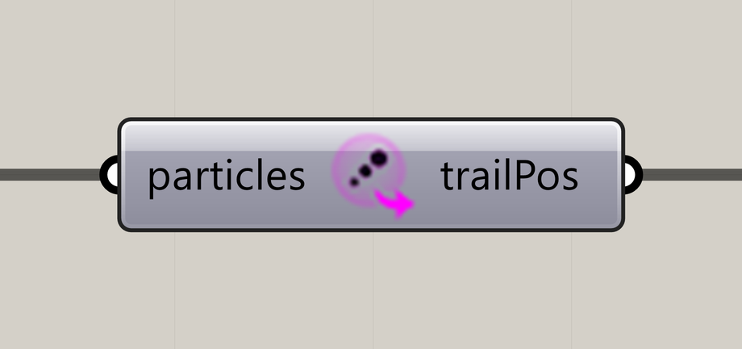

# Extract Particle Trails

Extract recorded trail points in separate branches so each particle can become its own curve.

**Location:** Nuclei4 → Particles



## Use it

Connect Particle Trail Settings to the solver with **Trail Size greater than 1**, then connect the solver's **particles** output here. Advance before expecting history.

For separate curves, connect **trailPos** to Grasshopper **Polyline** and preserve branches. Flattening first can join unrelated particles into one long curve. Each branch needs at least two points for a useful polyline.

## Input and output

| Input | Type / access | Default | Meaning |
| --- | --- | --- | --- |
| **Particles** (`particles`) | Generic Data / item | Required | The solver's evolving particle collection. |

| Output | Registered type / access | Actual result |
| --- | --- | --- |
| **Particle Positions** (`trailPos`) | Point / list | A point tree with a branch for each particle that has history. |

**Registered as a list, emitted as a tree:** preserve the actual output structure.

## Branches and point order

Paths use **`{groupIndex;particleIndex}`**. Both indices are zero-based. The second is the particle's index in the complete incoming collection; it does not restart for each group.

For example, if group 0 contains particles 0 and 1, and group 1 begins at particle 2:

```text
{0;0}: group 0, particle 0's trail points
{0;1}: group 0, particle 1's trail points
{1;2}: group 1, particle 2's trail points
```

Points run **newest to oldest** in the current V4 solver and use Rhino model coordinates. Missing particles and empty trails produce no branch, so indices need not be consecutive. Group membership comes from the solver's current groups; an unrecognized group falls back to index 0.

Trail Size limits recent point history, not curve length in model units. Reset clears history. Connect the extractor before collecting the history you need: the GPU solver tailors transfers to connected consumers.

## If something is wrong

| Symptom | Action |
| --- | --- |
| Empty output | Check solver connection and Trail Size, then advance after reset. |
| One curve jumps between unrelated trails | Remove flattening before Polyline and inspect paths with a Panel or Parameter Viewer. |
| Fewer branches than requested particles | The solver can retain fewer particles, and empty trails are omitted. |
| Extraction is slow | Reduce particle count or Trail Size while experimenting; pause before large extractions. |

The [Slime Intro walkthrough](../getting-started/first-slime-simulation.md) explains the original six-component setup. The extractor can be added downstream when you need curve geometry; see the [validation scope](../reference/pilot-validation.md).

## Continue

[Particle Trail Settings](particle-trail-settings.md) · [Particles and populations](../core-concepts/particles-and-populations.md) · [Component reference](README.md)

<details>
<summary>Machine-readable reference (JSON)</summary>

[Download JSON](../reference/components/extract-particle-trails.json) · [JSON Schema](../reference/component.schema.json) · [How to read this JSON](../reference/reading-json.md)

Runtime input: the particle collection emitted by `Nuclei4.SolverGPU`.

Component metadata for scripts and AI tools. Indices are zero-based; defaults are display strings. This describes the component, not an executable API. [Full catalog](../reference/component-contracts.json).

```json
{
  "$schema": "../component.schema.json",
  "schemaVersion": 1,
  "pluginVersion": "4.1.0.0",
  "ghaSha256": "700C1620FD839DD1511E67359961787C8EC08EA595812B2EDED27828F96800C5",
  "component": {
    "name": "Extract Particle Trails",
    "category": "Nuclei4",
    "subcategory": " Particles",
    "componentGuid": "0a97c625-4da3-4143-89c6-d88249de8741",
    "dotnetType": "Nuclei4.Particle_Extractor_TrailPoints",
    "inputs": [
      {
        "index": 0,
        "name": "Particles",
        "nickname": "particles",
        "ghType": "Generic Data",
        "access": "item",
        "optional": false,
        "mapping": "None",
        "defaults": []
      }
    ],
    "outputs": [
      {
        "index": 0,
        "name": "Particle Positions",
        "nickname": "trailPos",
        "ghType": "Point",
        "access": "list",
        "optional": false,
        "mapping": "None",
        "defaults": []
      }
    ]
  }
}
```

</details>
