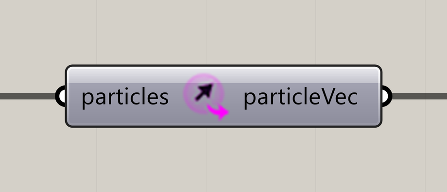

# Extract Particle Vectors

Extract each particle’s current direction.

**Location:** Nuclei4 → Particles



## Use it

Connect the solver’s **particles** output. Pair **particleVec** with particle positions from the same simulation state to display or use the directions.

## Inputs

Defaults describe a newly placed component.

| Input                       | Type / access       | Default  | Meaning                                      |
| --------------------------- | ------------------- | -------- | -------------------------------------------- |
| **Particles** (`particles`) | Generic Data / item | Required | Current particle collection from the solver. |

## Output

| Output                               | Type / access | Meaning                      |
| ------------------------------------ | ------------- | ---------------------------- |
| **Particle Vectors** (`particleVec`) | Vector / list | Current particle directions. |

## If something is wrong

| Symptom                         | Action                                                                    |
| ------------------------------- | ------------------------------------------------------------------------- |
| Vectors and points do not match | Use the same solver state and keep particle order when combining outputs. |

## Continue

[Component reference](./)

<details>

<summary>Machine-readable reference (JSON)</summary>

[Download JSON](../reference/components/extract-particle-vectors.json) · [JSON Schema](../reference/component.schema.json) · [How to read this JSON](../reference/reading-json.md)

Component metadata for scripts and AI tools. Indices are zero-based; defaults are display strings. [Full catalog](../reference/component-contracts.json).

```json
{
  "$schema": "../component.schema.json",
  "schemaVersion": 1,
  "pluginVersion": "4.1.0.0",
  "ghaSha256": "700C1620FD839DD1511E67359961787C8EC08EA595812B2EDED27828F96800C5",
  "component": {
    "name": "Extract Particle Vectors",
    "category": "Nuclei4",
    "subcategory": " Particles",
    "componentGuid": "59e6dba6-2cec-4873-8b54-9f099d3599c2",
    "dotnetType": "Nuclei4.Particle_Extractor_Vector",
    "inputs": [
      {
        "index": 0,
        "name": "Particles",
        "nickname": "particles",
        "ghType": "Generic Data",
        "access": "item",
        "optional": false,
        "mapping": "None",
        "defaults": []
      }
    ],
    "outputs": [
      {
        "index": 0,
        "name": "Particle Vectors",
        "nickname": "particleVec",
        "ghType": "Vector",
        "access": "list",
        "optional": false,
        "mapping": "None",
        "defaults": []
      }
    ]
  }
}
```

</details>
