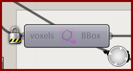

# Extract Voxel Bounding Box

Extract the bounding box of the whole voxel design space.

**Location:** Nuclei4 → Environment

*Captured from 03_Minimizing Transport Networks 1.gh, preserving its component position and connected controls. Example values can differ from the fresh-component defaults below.*

## Use it

Use this when downstream components need the overall extent of the voxel grid, for example to find its center. The output is one box spanning the design space.

## Inputs

| Input | Data | Default | Purpose |
| --- | --- | --- | --- |
| **Voxels** (`voxels`) | Generic Data; item | Supply input | Connects to Voxel Constructor |

Defaults describe a newly placed component. A saved definition can store other values on an unconnected input.

## Outputs

| Output | Data | Purpose |
| --- | --- | --- |
| **Voxel Box** (`BBox`) | Box; item | Voxel Bounding Box |

## In the example collection

- [03_Minimizing Transport Networks 1](../examples/03-minimizing-transport-networks-1.md)
- [04_Minimizing Transport Networks 2](../examples/04-minimizing-transport-networks-2.md)
- [06_Attractor Curves 1](../examples/06-attractor-curves-1.md)

[Back to the component reference](README.md)
