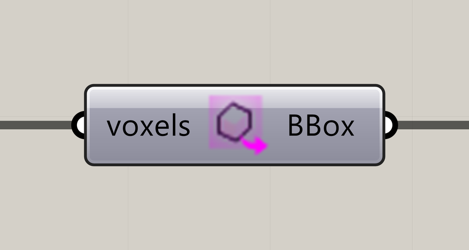

# Extract Voxel Bounding Box

Extract the bounding box of the voxel grid.

**Location:** Nuclei4 → Environment



## Use it

Connect the field to **voxels**. Use **BBox** to inspect the grid extent or build related geometry. A selection still returns the box of its underlying grid.

## Inputs

Defaults describe a newly placed component.

| Input                 | Type / access       | Default  | Meaning                          |
| --------------------- | ------------------- | -------- | -------------------------------- |
| **Voxels** (`voxels`) | Generic Data / item | Required | Voxel field or selection to use. |

## Output

| Output                 | Type / access | Meaning                                   |
| ---------------------- | ------------- | ----------------------------------------- |
| **Voxel Box** (`BBox`) | Box / item    | Bounding box of the full underlying grid. |

## If something is wrong

| Symptom                           | Action                                                                       |
| --------------------------------- | ---------------------------------------------------------------------------- |
| The box includes unselected cells | The output describes the full grid, including when the input is a selection. |

## Continue

[Minimizing Transport Networks 1](../examples/03-minimizing-transport-networks-1.md) · [Minimizing Transport Networks 2](../examples/04-minimizing-transport-networks-2.md) · [Attractor Curves 1](../examples/06-attractor-curves-1.md) · [Component reference](./)

<details>

<summary>Machine-readable reference (JSON)</summary>

[Download JSON](../reference/components/extract-voxel-bounding-box.json) · [JSON Schema](../reference/component.schema.json) · [How to read this JSON](../reference/reading-json.md)

Component metadata for scripts and AI tools. Indices are zero-based; defaults are display strings. [Full catalog](../reference/component-contracts.json).

```json
{
  "$schema": "../component.schema.json",
  "schemaVersion": 1,
  "pluginVersion": "4.1.0.0",
  "ghaSha256": "700C1620FD839DD1511E67359961787C8EC08EA595812B2EDED27828F96800C5",
  "component": {
    "name": "Extract Voxel Bounding Box",
    "category": "Nuclei4",
    "subcategory": " Environment",
    "componentGuid": "f02270d9-89f0-4465-93ac-750061478aed",
    "dotnetType": "Nuclei4.Voxel_Extractor_Box",
    "inputs": [
      {
        "index": 0,
        "name": "Voxels",
        "nickname": "voxels",
        "ghType": "Generic Data",
        "access": "item",
        "optional": false,
        "mapping": "None",
        "defaults": []
      }
    ],
    "outputs": [
      {
        "index": 0,
        "name": "Voxel Box",
        "nickname": "BBox",
        "ghType": "Box",
        "access": "item",
        "optional": false,
        "mapping": "None",
        "defaults": []
      }
    ]
  }
}
```

</details>
