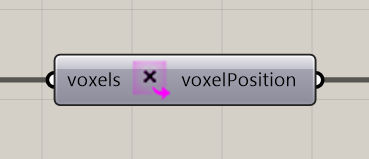

# Extract Voxel Positions

Extract voxel centers as Rhino points.

**Location:** Nuclei4 → Environment



## Use it

Connect the field or selection to **voxels**. Use **voxelPosition** for point-based operations or to display the selected cells.

## Inputs

Defaults describe a newly placed component.

| Input | Type / access | Default | Meaning |
| --- | --- | --- | --- |
| **Voxels** (`voxels`) | Generic Data / item | Required | Voxel field or selection to use. |

## Output

| Output | Type / access | Meaning |
| --- | --- | --- |
| **Voxel Positions** (`voxelPosition`) | Point / list | Centers of the selected voxels. |

## If something is wrong

| Symptom | Action |
| --- | --- |
| Only part of the grid appears | Check whether the input is a selection. |
| Points are offset from the grid boundary | The output contains cell centers. |

## Continue

[Gradient Map](../examples/02-gradient-map.md) · [Component reference](README.md)

<details>
<summary>Machine-readable reference (JSON)</summary>

[Download JSON](../reference/components/extract-voxel-positions.json) · [JSON Schema](../reference/component.schema.json) · [How to read this JSON](../reference/reading-json.md)

Component metadata for scripts and AI tools. Indices are zero-based; defaults are display strings. [Full catalog](../reference/component-contracts.json).

```json
{
  "$schema": "../component.schema.json",
  "schemaVersion": 1,
  "pluginVersion": "4.1.0.0",
  "ghaSha256": "700C1620FD839DD1511E67359961787C8EC08EA595812B2EDED27828F96800C5",
  "component": {
    "name": "Extract Voxel Positions",
    "category": "Nuclei4",
    "subcategory": " Environment",
    "componentGuid": "deb55383-1cb3-4b17-8d01-cc05d1b9c635",
    "dotnetType": "Nuclei4.Voxel_Extractor_Point",
    "inputs": [
      {
        "index": 0,
        "name": "Voxels",
        "nickname": "voxels",
        "ghType": "Generic Data",
        "access": "item",
        "optional": false,
        "mapping": "None",
        "defaults": []
      }
    ],
    "outputs": [
      {
        "index": 0,
        "name": "Voxel Positions",
        "nickname": "voxelPosition",
        "ghType": "Point",
        "access": "list",
        "optional": false,
        "mapping": "None",
        "defaults": []
      }
    ]
  }
}
```

</details>
