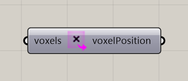

# Extract Voxel Positions

Extract voxel center positions.

**Location:** Nuclei4 → Environment

*Captured from 02_Gradient Map.gh, with its connected sliders and primitives arranged beside the component for readability. Example values can differ from the fresh-component defaults below.*

## Use it

Use the centers to evaluate distances, expressions, or external fields. Preserve their ordering when mapping a list of values back onto the same voxel selection.

## Inputs

| Input | Data | Default | Purpose |
| --- | --- | --- | --- |
| **Voxels** (`voxels`) | Generic Data; item | Supply input | Connects to Voxel Constructor |

Defaults describe a newly placed component. A saved definition can store other values on an unconnected input.

## Outputs

| Output | Data | Purpose |
| --- | --- | --- |
| **Voxel Positions** (`voxelPosition`) | Point; list | Centers of Voxels |

## In the example collection

- [02_Gradient Map](../examples/02-gradient-map.md)

[Back to the component reference](README.md)
