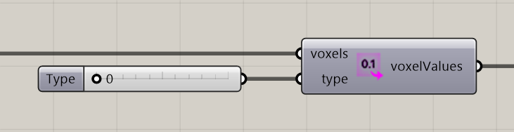

# Extract Voxel Values

Extract the selected voxel property as numeric values.

**Location:** Nuclei4 → Environment

## Use it

Choose a Type matching your intended field. Use the solver’s voxels output for current density or pheromones. Keep the values aligned with positions from the same selection.

## Inputs

| Input | Data | Default | Purpose |
| --- | --- | --- | --- |
| **Voxels** (`voxels`) | Generic Data; item | Supply input | Connects to Voxel Constructor |
| **Type** (`type`) | Integer; item | 0 | Type of Voxel Value |

Defaults describe a newly placed component. A saved definition can store other values on an unconnected input.

## Outputs

| Output | Data | Purpose |
| --- | --- | --- |
| **Voxel Values** (`voxelValues`) | Number; list | Voxel Values |

## Related workflow

Use the input and output roles above with the [voxel-field](../core-concepts/voxels-and-fields.md) or [particle](../core-concepts/particles-and-populations.md) workflow.

[Back to the component reference](README.md)
