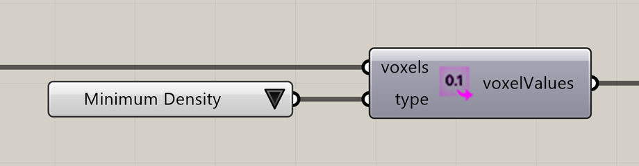

# Extract Voxel Values

Extract values for a chosen voxel property.

**Location:** Nuclei4 → Environment



## Use it

Connect the field and choose **Type**. Use the solver’s field for evolving signals, or a mapped field for static values.

Pair **voxelValues** with positions extracted from the same field to keep values and cells aligned.

## Inputs

Defaults describe a newly placed component.

| Input                 | Type / access       | Default  | Meaning                                      |
| --------------------- | ------------------- | -------- | -------------------------------------------- |
| **Voxels** (`voxels`) | Generic Data / item | Required | Voxel field or selection to use.             |
| **Type** (`type`)     | Integer / item      | 0        | Property to use; see **Type choices** below. |

### Type choices

| Value | Choice                 |
| ----- | ---------------------- |
| 0     | Minimum Density        |
| 1     | Maximum Density        |
| 2     | Speed                  |
| 3     | Sensor Distance        |
| 4     | Sensor Angle           |
| 5     | Rotation Angle         |
| 6     | Slime Food             |
| 13    | Ant Food               |
| 7     | Slime Chemoattractants |
| 8     | Ant Food Pheromones    |
| 9     | Ant Base Pheromones    |

## Output

| Output                           | Type / access | Meaning                                         |
| -------------------------------- | ------------- | ----------------------------------------------- |
| **Voxel Values** (`voxelValues`) | Number / list | Values for the chosen property, in voxel order. |

## If something is wrong

| Symptom                        | Action                                         |
| ------------------------------ | ---------------------------------------------- |
| Unexpected values              | Check Type and which field is connected.       |
| Values do not match the points | Extract both from the same field or selection. |

## Continue

[Component reference](./)

<details>

<summary>Machine-readable reference (JSON)</summary>

[Download JSON](../reference/components/extract-voxel-values.json) · [JSON Schema](../reference/component.schema.json) · [How to read this JSON](../reference/reading-json.md)

Component metadata for scripts and AI tools. Indices are zero-based; defaults are display strings. [Full catalog](../reference/component-contracts.json).

```json
{
  "$schema": "../component.schema.json",
  "schemaVersion": 1,
  "pluginVersion": "4.1.0.0",
  "ghaSha256": "700C1620FD839DD1511E67359961787C8EC08EA595812B2EDED27828F96800C5",
  "component": {
    "name": "Extract Voxel Values",
    "category": "Nuclei4",
    "subcategory": " Environment",
    "componentGuid": "9668d334-4d67-464e-9e19-c581c49c26a7",
    "dotnetType": "Nuclei4.Voxel_Extractor_Values",
    "inputs": [
      {
        "index": 0,
        "name": "Voxels",
        "nickname": "voxels",
        "ghType": "Generic Data",
        "access": "item",
        "optional": false,
        "mapping": "None",
        "defaults": []
      },
      {
        "index": 1,
        "name": "Type",
        "nickname": "type",
        "ghType": "Integer",
        "access": "item",
        "optional": false,
        "mapping": "None",
        "defaults": [
          "0"
        ]
      }
    ],
    "outputs": [
      {
        "index": 0,
        "name": "Voxel Values",
        "nickname": "voxelValues",
        "ghType": "Number",
        "access": "list",
        "optional": false,
        "mapping": "None",
        "defaults": []
      }
    ]
  }
}
```

</details>
