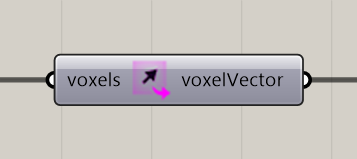

# Extract Voxel Vector

Extract the vectors stored in a voxel field.

**Location:** Nuclei4 → Environment

## Use it

Use positions from the same field to visualize directions. Vector data describes the mapped field, rather than individual particle headings.

## Inputs

| Input | Data | Default | Purpose |
| --- | --- | --- | --- |
| **Voxels** (`voxels`) | Generic Data; item | Supply input | Connects to Voxel Constructor |

Defaults describe a newly placed component. A saved definition can store other values on an unconnected input.

## Outputs

| Output | Data | Purpose |
| --- | --- | --- |
| **Voxel Vectors** (`voxelVector`) | Vector; list | Voxel Vectors |

## Related workflow

Use the input and output roles above with the [voxel-field](../core-concepts/voxels-and-fields.md) or [particle](../core-concepts/particles-and-populations.md) workflow.

[Back to the component reference](README.md)
