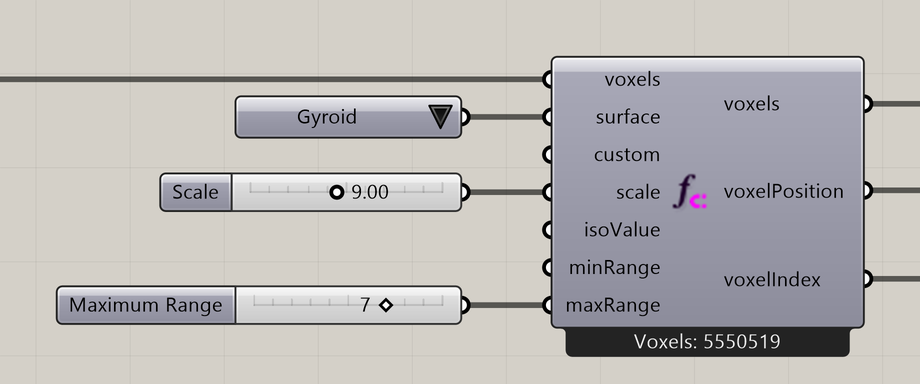

# Function Attractor

Select voxels around a mathematical surface.

**Location:** Nuclei4 → Environment



## Use it

Connect a field to **voxels** and choose a preset from **Surface**. **Scale** changes how the pattern repeats within the field; **Iso Value** selects the function level. **Minimum Range** and **Maximum Range** set how close to and how far from the mathematical surface voxels are selected.

Use the **voxels** output to map properties or initialize particles in the selected region.

## Inputs

Defaults describe a newly placed component.

| Input | Type / access | Default | Meaning |
| --- | --- | --- | --- |
| **Voxels** (`voxels`) | Generic Data / item | Required | Voxel field or selection to use. |
| **Surface** (`surface`) | Integer / item | Optional; 1 | Preset surface; see **Surface choices** below. A connected Custom formula overrides it. |
| **Custom** (`custom`) | Text / item | Optional; empty | Optional expression in x, y, and z. |
| **Scale** (`scale`) | Number / item | 2.0 * Pi | Coordinate span across each grid axis; 2π gives one period for periodic presets. |
| **Iso Value** (`isoValue`) | Number / item | 0 | Function level defining the surface. |
| **Minimum Range** (`minRange`) | Number / item | 0 | Minimum distance from the attractor, in model units. |
| **Maximum Range** (`maxRange`) | Number / item | 2 | Maximum distance from the attractor, in model units. |

### Surface choices

| Value | Choice |
| --- | --- |
| 1 | Gyroid |
| 2 | Schwarz D |
| 3 | Schwarz G |
| 4 | Schwarz P |
| 5 | Neovius |
| 6 | Diamond |
| 7 | P W Hybrid |
| 9 | IWP |
| 10 | Fischer-Koch S |
| 11 | Lidinoid |
| 12 | Twisted Sheets |
| 14 | Interference Field |
| 15 | Tanglecube |
| 16 | Trefoil Knot |
| 18 | Warped Caves |

## Outputs

| Output | Type / access | Meaning |
| --- | --- | --- |
| **Output Voxels** (`voxels`) | Generic Data / item | Selected or modified voxel field. |
| **Output Voxel Positions** (`voxelPosition`) | Point / list | Centers of the selected voxels. |
| **Output Voxel Indices** (`voxelIndex`) | Integer / list | Indices of the selected voxels, paired with the position output. |

## Custom formulas

Connect a text Panel to **Custom** to use your own formula in `x`, `y`, and `z`. For example:

```text
Math.Cos(x) * Math.Sin(y) + Math.Cos(y) * Math.Sin(z) + Math.Cos(z) * Math.Sin(x)
```

Custom overrides Surface while connected. Disconnect it to use the preset again. The formula is an expression without an assignment or semicolon. Surface distances are approximate and limited by the grid resolution.

## If something is wrong

| Symptom | Action |
| --- | --- |
| Custom formula error | Check the expression and remove any assignment or semicolon. |
| Changing Surface has no effect | Disconnect Custom to return to presets. |
| Thin features disappear | Check the voxel resolution and range. |

## Continue

[Function Voxels](../examples/16-function-voxels.md) · [Component reference](README.md)

<details>
<summary>Machine-readable reference (JSON)</summary>

[Download JSON](../reference/components/function-attractor.json) · [JSON Schema](../reference/component.schema.json) · [How to read this JSON](../reference/reading-json.md)

Component metadata for scripts and AI tools. Indices are zero-based; defaults are display strings. [Full catalog](../reference/component-contracts.json).

```json
{
  "$schema": "../component.schema.json",
  "schemaVersion": 1,
  "pluginVersion": "4.1.0.0",
  "ghaSha256": "700C1620FD839DD1511E67359961787C8EC08EA595812B2EDED27828F96800C5",
  "component": {
    "name": "Function Attractor",
    "category": "Nuclei4",
    "subcategory": " Environment",
    "componentGuid": "99408ead-53f2-4ecb-8d3d-afd2f4dca58c",
    "dotnetType": "Nuclei4.Voxel_PeriodicSurface",
    "inputs": [
      {
        "index": 0,
        "name": "Voxels",
        "nickname": "voxels",
        "ghType": "Generic Data",
        "access": "item",
        "optional": false,
        "mapping": "None",
        "defaults": []
      },
      {
        "index": 1,
        "name": "Surface",
        "nickname": "surface",
        "ghType": "Integer",
        "access": "item",
        "optional": true,
        "mapping": "None",
        "defaults": [
          "1"
        ]
      },
      {
        "index": 2,
        "name": "Custom",
        "nickname": "custom",
        "ghType": "Text",
        "access": "item",
        "optional": true,
        "mapping": "None",
        "defaults": [
          ""
        ]
      },
      {
        "index": 3,
        "name": "Scale",
        "nickname": "scale",
        "ghType": "Number",
        "access": "item",
        "optional": false,
        "mapping": "None",
        "defaults": [
          "2.0 * Pi"
        ]
      },
      {
        "index": 4,
        "name": "Iso Value",
        "nickname": "isoValue",
        "ghType": "Number",
        "access": "item",
        "optional": false,
        "mapping": "None",
        "defaults": [
          "0"
        ]
      },
      {
        "index": 5,
        "name": "Minimum Range",
        "nickname": "minRange",
        "ghType": "Number",
        "access": "item",
        "optional": false,
        "mapping": "None",
        "defaults": [
          "0"
        ]
      },
      {
        "index": 6,
        "name": "Maximum Range",
        "nickname": "maxRange",
        "ghType": "Number",
        "access": "item",
        "optional": false,
        "mapping": "None",
        "defaults": [
          "2"
        ]
      }
    ],
    "outputs": [
      {
        "index": 0,
        "name": "Output Voxels",
        "nickname": "voxels",
        "ghType": "Generic Data",
        "access": "item",
        "optional": false,
        "mapping": "None",
        "defaults": []
      },
      {
        "index": 1,
        "name": "Output Voxel Positions",
        "nickname": "voxelPosition",
        "ghType": "Point",
        "access": "list",
        "optional": false,
        "mapping": "None",
        "defaults": []
      },
      {
        "index": 2,
        "name": "Output Voxel Indices",
        "nickname": "voxelIndex",
        "ghType": "Integer",
        "access": "list",
        "optional": false,
        "mapping": "None",
        "defaults": []
      }
    ]
  }
}
```

</details>
