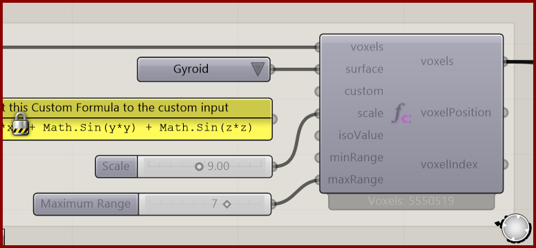

# Function Attractor

Select a band of voxels around an implicit function surface.

**Location:** Nuclei4 → Environment

*Captured from 16_Function Voxels.gh, preserving its component position and connected controls. Example values can differ from the fresh-component defaults below.*

## Use it

Choose a preset or connect a Custom expression to override it. Scale controls the coordinate span; Iso Value selects the function level. Min/Max Range describe approximate physical distance on both sides of the surface. Grid resolution limits thin features; the selection is not a guarantee of watertight meshing.

## Inputs

| Input | Data | Default | Purpose |
| --- | --- | --- | --- |
| **Voxels** (`voxels`) | Generic Data; item | Supply input | Voxels from Construct Voxels or a voxel selection; preserves voxel settings |
| **Surface** (`surface`) | Integer; item | 1 | Predefined function from the value list. A connected Custom formula overrides this selection. Disconnect Custom to use the preset again. |
| **Custom** (`custom`) | Text; item | Optional | F(x,y,z) -> here I input the formula. Connect a panel to override Surface automatically, for example: Math.Cos(x) * Math.Sin(y) + Math.Cos(y) * Math.Sin(z) + Math.Cos(z) * Math.Sin(x). Supports arithmetic and Math.Sin/Cos/Tan, inverse and hyperbolic trig, Abs, Sqrt, Pow, Exp, Log, Log10, Floor, Ceiling, Min, Max, PI and E. No assignment or semicolon. |
| **Scale** (`scale`) | Number; item | 2.0 * Pi | Coordinate span across each grid axis. Original periodic presets, IWP, Fischer-Koch S, Lidinoid and Custom: x = scale * indexX / resX (similarly y, z); 2*pi gives one period. Twisted Sheets through Warped Caves are centered: x = scale * (indexX - (resX-1)/2) / resX. |
| **Iso Value** (`isoValue`) | Number; item | 0 | Function level defining the surface: f(x,y,z) = isoValue |
| **Minimum Range** (`minRange`) | Number; item | 0 | Minimum distance in model units. Supplied reversed ranges are sorted. Thin walls retain neighboring voxels bracketing the wall; rasterized centers can extend beyond the requested interval. Function distances are approximate, on both sides of the surface. |
| **Maximum Range** (`maxRange`) | Number; item | 2 | Maximum distance in model units. An omitted maximum grows from minRange if needed. Range width is at least one voxel size; thin walls additionally retain bracketing voxel pairs for at least two neighboring layers total, subject to available input voxels. Function distances are approximate. Limited to available input voxels and grid-resolved features. |

Defaults describe a newly placed component. A saved definition can store other values on an unconnected input.

## Outputs

| Output | Data | Purpose |
| --- | --- | --- |
| **Output Voxels** (`voxels`) | Generic Data; item | Selected voxels |
| **Output Voxel Positions** (`voxelPosition`) | Point; list | Selected centers; hidden and computed only when connected |
| **Output Voxel Indices** (`voxelIndex`) | Integer; list | Zero-based ordinals in the output selection, matching Curve Attractor; computed only when connected |

## In the example collection

- [16_Function Voxels](../examples/16-function-voxels.md)

[Back to the component reference](README.md)
