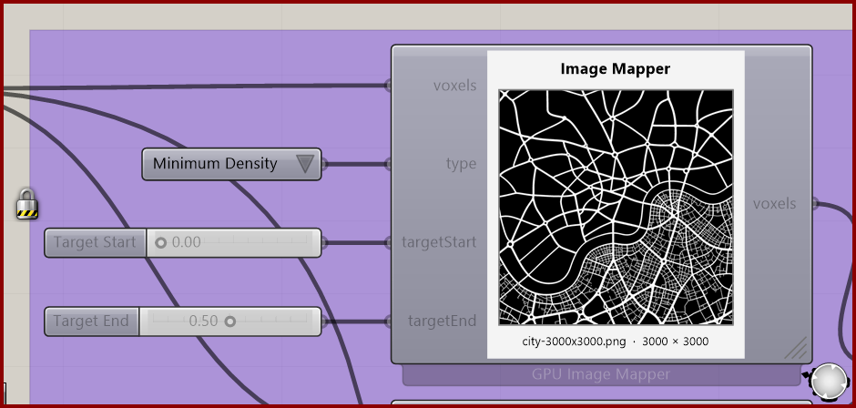

# Image Mapper for Voxels

Map image brightness to a voxel property across a planar field.

**Location:** Nuclei4 → Environment

*Captured from 05_City Map.gh, preserving its component position and connected controls. Example values can differ from the fresh-component defaults below.*

## Use it

Double-click to select an image. Black maps to targetStart and white to targetEnd; reversed endpoints invert the range. The image is embedded in the definition. XY, XZ, and YZ planes are supported; 3D fields are rejected. Different aspect ratios stretch the map.

## Inputs

| Input | Data | Default | Purpose |
| --- | --- | --- | --- |
| **Voxels** (`voxels`) | Generic Data; item | Supply input | A 2D voxel field in XY, XZ or YZ. The entire grid domain maps to 0–1 on both axes. |
| **Type** (`type`) | Integer; item | 0 | Voxel property to define, as in Define Voxel Values. |
| **Target Start** (`targetStart`) | Number; item | 0 | Value assigned to black. Can be higher than targetEnd to reverse the mapping. |
| **Target End** (`targetEnd`) | Number; item | 1 | Value assigned to white. Equal endpoints create a constant map. Density types retain the limits of Define Voxel Values. |

Defaults describe a newly placed component. A saved definition can store other values on an unconnected input.

## Outputs

| Output | Data | Purpose |
| --- | --- | --- |
| **Output Voxels** (`voxels`) | Generic Data; item | Voxels with the selected property defined by the remapped image. |

## In the example collection

- [05_City Map](../examples/05-city-map.md)
- [05_City Map2](../examples/05-city-map2.md)

[Back to the component reference](README.md)
