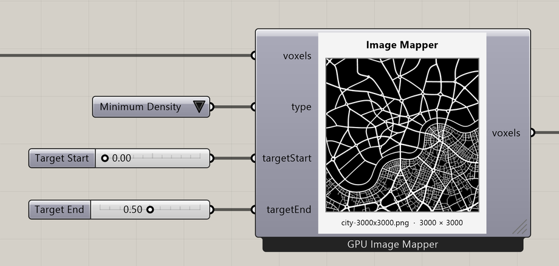

# Image Mapper for Voxels

Map the light and dark areas of an image to values in a 2D voxel field.

**Location:** Nuclei4 → Environment



## Use it

Connect a 2D field to **voxels**. Double-click the component, or right-click and choose **Choose image…**, to load an image. Select the property with **Type**.

**Target Start** sets the value for black; **Target End** sets the value for white. Gray values fall between them. Connect the output field to the solver or a preview of the same property.

## Inputs

Defaults describe a newly placed component.

| Input | Type / access | Default | Meaning |
| --- | --- | --- | --- |
| **Voxels** (`voxels`) | Generic Data / item | Required | Voxel field or selection to use. |
| **Type** (`type`) | Integer / item | 0 | Property to use; see **Type choices** below. |
| **Target Start** (`targetStart`) | Number / item | 0 | Value assigned to black pixels. |
| **Target End** (`targetEnd`) | Number / item | 1 | Value assigned to white pixels. |

### Type choices

| Value | Choice |
| --- | --- |
| 0 | Minimum Density |
| 1 | Maximum Density |
| 2 | Speed |
| 3 | Sensor Distance |
| 4 | Sensor Angle |
| 5 | Rotation Angle |
| 6 | Slime Food |
| 13 | Ant Food |

## Output

| Output | Type / access | Meaning |
| --- | --- | --- |
| **Output Voxels** (`voxels`) | Generic Data / item | Selected or modified voxel field. |

## Image mapping

The image covers the full grid domain. XY, XZ, and YZ fields are supported. Swap Target Start and Target End to reverse the mapping; equal values make a constant map.

## If something is wrong

| Symptom | Action |
| --- | --- |
| Only 2D Voxel Field Allowed | Use a field with one cell along one axis. |
| No image selected | Double-click the component and choose an image. |
| Map appears unchanged | Check Type and the two target values. |

## Continue

[City Map](../examples/05-city-map.md) · [City Map — alternate definition](../examples/05-city-map2.md) · [Component reference](README.md)

<details>
<summary>Machine-readable reference (JSON)</summary>

Component metadata for scripts and AI tools. Indices are zero-based; defaults are display strings. [Full catalog](../reference/component-contracts.json).

```json
{
  "schemaVersion": 1,
  "pluginVersion": "4.1.0.0",
  "ghaSha256": "700C1620FD839DD1511E67359961787C8EC08EA595812B2EDED27828F96800C5",
  "component": {
    "name": "Image Mapper for Voxels",
    "category": "Nuclei4",
    "subcategory": " Environment",
    "componentGuid": "d33e509c-f8ae-41b3-83e3-40e33685396f",
    "dotnetType": "Nuclei4.Voxel_ImageMapper",
    "inputs": [
      {
        "index": 0,
        "name": "Voxels",
        "nickname": "voxels",
        "ghType": "Generic Data",
        "access": "item",
        "optional": false,
        "mapping": "None",
        "defaults": []
      },
      {
        "index": 1,
        "name": "Type",
        "nickname": "type",
        "ghType": "Integer",
        "access": "item",
        "optional": false,
        "mapping": "None",
        "defaults": [
          "0"
        ]
      },
      {
        "index": 2,
        "name": "Target Start",
        "nickname": "targetStart",
        "ghType": "Number",
        "access": "item",
        "optional": false,
        "mapping": "None",
        "defaults": [
          "0"
        ]
      },
      {
        "index": 3,
        "name": "Target End",
        "nickname": "targetEnd",
        "ghType": "Number",
        "access": "item",
        "optional": false,
        "mapping": "None",
        "defaults": [
          "1"
        ]
      }
    ],
    "outputs": [
      {
        "index": 0,
        "name": "Output Voxels",
        "nickname": "voxels",
        "ghType": "Generic Data",
        "access": "item",
        "optional": false,
        "mapping": "None",
        "defaults": []
      }
    ]
  }
}
```

</details>
