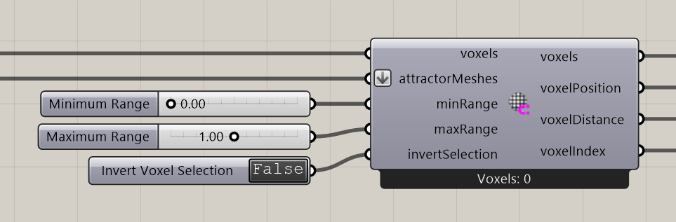

# Mesh Attractor for Voxel

Select voxels within a distance band around meshes.

**Location:** Nuclei4 → Environment

## Use it

Use this for a near-surface region. Use Voxel Inclusion in Mesh when you want an inside/outside selection instead. Distance bands are limited by voxel resolution and the input selection.

## Inputs

| Input | Data | Default | Purpose |
| --- | --- | --- | --- |
| **Voxels** (`voxels`) | Generic Data; item | Supply input | Connects to Voxel Constructor |
| **Attractor Meshes** (`attractorMeshes`) | Mesh; list | Supply input | Attractor Meshes |
| **Minimum Range** (`minRange`) | Number; item | 0 | Minimum distance in model units. Supplied reversed ranges are sorted. Thin walls retain neighboring voxels bracketing the wall; rasterized centers can extend beyond the requested interval. |
| **Maximum Range** (`maxRange`) | Number; item | 1 | Maximum distance in model units. An omitted maximum grows from minRange if needed. Range width is at least one voxel size; thin walls additionally retain bracketing voxel pairs for at least two neighboring layers total, subject to available input voxels. |
| **Invert Voxel Selection** (`invertSelection`) | Boolean; item | False | Inverts the Voxel Selection |

Defaults describe a newly placed component. A saved definition can store other values on an unconnected input.

## Outputs

| Output | Data | Purpose |
| --- | --- | --- |
| **Output Voxels** (`voxels`) | Generic Data; item | Output Voxels |
| **Output Voxel Positions** (`voxelPosition`) | Point; list | Output Voxel Positions |
| **Output Distances to Voxels** (`voxelDistance`) | Number; list | Output Distances from Attractor to Voxel |
| **Output Voxel Indices** (`voxelIndex`) | Integer; list | Output Voxel Indices for Sorting |

## Related workflow

Use the input and output roles above with the [voxel-field](../core-concepts/voxels-and-fields.md) or [particle](../core-concepts/particles-and-populations.md) workflow.

[Back to the component reference](README.md)
