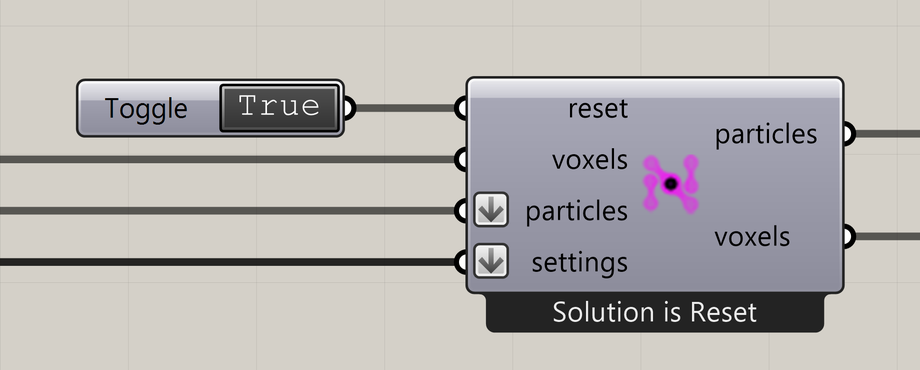

# Nuclei4 Solver GPU

Advance the simulation and provide its evolving particles and voxel field.

**Location:** Nuclei4 → Solver



## Use it

1. Pause the solver's Trigger.
2. Connect the field, particle group, and required settings components.
3. Set **Reset True** to initialize, then return it to **False**.
4. Start the Trigger to request repeated solutions. Pause it to stop advancing.

Each non-reset solver solution advances one iteration while the inputs and GPU are valid and the iteration limit has not been reached. The Trigger interval is not a guaranteed frame rate.

## Inputs

Required inputs have no stored default on a fresh component.

| Input                            | Type / access         | Default  | Meaning                                                                   |
| -------------------------------- | --------------------- | -------- | ------------------------------------------------------------------------- |
| **Reset** (`reset`)              | Boolean / item        | Required | True initializes; False allows advancement.                               |
| **Voxels** (`voxels`)            | Generic Data / item   | Required | One Nuclei field describing the environment.                              |
| **Particles** (`particles`)      | Particle Group / list | Required | One or more starting populations. Incoming groups are flattened.          |
| **Solver Settings** (`settings`) | Text / list           | Optional | Outputs from Nuclei settings components. Incoming settings are flattened. |

Multiple settings wires are intentional. Hold **Shift** while adding another wire in Grasshopper to preserve an existing connection. Slime Intro connects both Particle Trail Settings and Voxel Settings Slime to **settings**.

Use one settings component of each needed kind. Repeated settings of the same kind can overwrite earlier values as the list is processed.

Without settings, built-in limits include **100,000 maximum iterations**, reflective boundaries, and **Trail Size 0**. Add Particle Trail Settings with a size greater than 1 for useful history.

## Outputs

| Output                             | Type / access       | Meaning                                                     |
| ---------------------------------- | ------------------- | ----------------------------------------------------------- |
| **Output Particles** (`particles`) | Generic Data / item | One evolving collection for Nuclei previews and extractors. |
| **Output Voxels** (`voxels`)       | Generic Data / item | The evolving field, including simulation signals.           |

These are Nuclei objects, not ordinary Grasshopper geometry lists. Use particle extractors for points. Connect voxel preview/extraction to the solver output when inspecting changing signals.

## Reset, pause, and boundaries

Holding Reset True reinitializes every solution and clears history. Changes to the domain or starting population can require reinitialization; pause and reset deliberately when comparing starting conditions.

Default reflective boundaries exclude outer cells along non-singleton axes from eligible starting cells. Reset also resolves several particles in the same cell. [Slime Intro](../getting-started/first-slime-simulation.md) requests 50,000 and retains 49,801 in the tested build.

At the iteration limit, the solver can pause its dedicated Trigger. Reset or raise the limit with **Nuclei4 Solver Iterations**, then re-enable the Trigger.

## If something is wrong

| Message or symptom                          | Action                                                                                                        |
| ------------------------------------------- | ------------------------------------------------------------------------------------------------------------- |
| `Solution is Reset` never changes           | Return Reset to False before starting the Trigger.                                                            |
| Iteration does not advance                  | Check Trigger targeting, runtime errors, and the iteration limit.                                             |
| `GPU unavailable`                           | Inspect the warning and confirm the supported Rhino/Windows/GPU setup.                                        |
| `GPU reset failed:` or `GPU solver failed:` | Include the full runtime error and a small definition when reporting the issue.                               |
| Empty trails after reset                    | Use Trail Size greater than 1 and advance several steps.                                                      |
| Extraction slows the graph                  | It requests CPU-visible data and builds Grasshopper geometry. Pause large downstream operations while tuning. |

Read the component message and runtime warnings/errors.

## Continue

[Slime Intro](../getting-started/first-slime-simulation.md) · [Extract Particle Trails](extract-particle-trails.md) · [Troubleshooting](../troubleshooting.md) · [Component reference](./)

<details>

<summary>Machine-readable reference (JSON)</summary>

[Download JSON](../reference/components/nuclei4-solver-gpu.json) · [JSON Schema](../reference/component.schema.json) · [How to read this JSON](../reference/reading-json.md)

Runtime outputs: `Nuclei4.ParticleList` and `Nuclei4.VoxelField`.

Component metadata for scripts and AI tools. Indices are zero-based; defaults are display strings. This describes the component, not an executable API. [Full catalog](../reference/component-contracts.json).

```json
{
  "$schema": "../component.schema.json",
  "schemaVersion": 1,
  "pluginVersion": "4.1.0.0",
  "ghaSha256": "700C1620FD839DD1511E67359961787C8EC08EA595812B2EDED27828F96800C5",
  "component": {
    "name": "Nuclei4 Solver GPU",
    "category": "Nuclei4",
    "subcategory": " Solver",
    "componentGuid": "e794ab27-6d27-4107-929f-b88e16209976",
    "dotnetType": "Nuclei4.SolverGPU",
    "inputs": [
      {
        "index": 0,
        "name": "Reset",
        "nickname": "reset",
        "ghType": "Boolean",
        "access": "item",
        "optional": false,
        "mapping": "None",
        "defaults": []
      },
      {
        "index": 1,
        "name": "Voxels",
        "nickname": "voxels",
        "ghType": "Generic Data",
        "access": "item",
        "optional": false,
        "mapping": "None",
        "defaults": []
      },
      {
        "index": 2,
        "name": "Particles",
        "nickname": "particles",
        "ghType": "Particle Group",
        "access": "list",
        "optional": false,
        "mapping": "Flatten",
        "defaults": []
      },
      {
        "index": 3,
        "name": "Solver Settings",
        "nickname": "settings",
        "ghType": "Text",
        "access": "list",
        "optional": true,
        "mapping": "Flatten",
        "defaults": []
      }
    ],
    "outputs": [
      {
        "index": 0,
        "name": "Output Particles",
        "nickname": "particles",
        "ghType": "Generic Data",
        "access": "item",
        "optional": false,
        "mapping": "None",
        "defaults": []
      },
      {
        "index": 1,
        "name": "Output Voxels",
        "nickname": "voxels",
        "ghType": "Generic Data",
        "access": "item",
        "optional": false,
        "mapping": "None",
        "defaults": []
      }
    ]
  }
}
```

</details>
