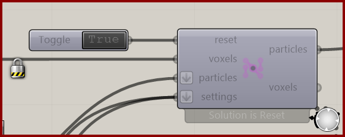

# Nuclei4 Solver GPU

Advance the V4 simulation using the input voxel field, particle groups, and settings.

**Location:** Nuclei4 → Solver

*Captured from 01_Slime Intro.gh, preserving its component position and connected controls. Example values can differ from the fresh-component defaults below.*

## Use it

Reset True initializes the simulation; return it to False before enabling the Trigger. Combine settings wires at the settings input. Particles and Voxels carry evolving outputs. The current solver has no status output: use runtime messages for errors.

## Inputs

| Input | Data | Default | Purpose |
| --- | --- | --- | --- |
| **Reset** (`reset`) | Boolean; item | Supply input | Reset Boolean |
| **Voxels** (`voxels`) | Generic Data; item | Supply input | Connects to Voxel Constructor |
| **Particles** (`particles`) | Particle Group; list | Supply input | Connects to Particle Constructors |
| **Solver Settings** (`settings`) | Text; list | Optional | Connects to Settings |

Defaults describe a newly placed component. A saved definition can store other values on an unconnected input.

## Outputs

| Output | Data | Purpose |
| --- | --- | --- |
| **Output Particles** (`particles`) | Generic Data; item | Output Particles |
| **Output Voxels** (`voxels`) | Generic Data; item | Output Voxels |

## In the example collection

- [01_Slime Intro](../examples/01-slime-intro.md)
- [02_Gradient Map](../examples/02-gradient-map.md)
- [03_Minimizing Transport Networks 1](../examples/03-minimizing-transport-networks-1.md)

[Back to the component reference](README.md)
