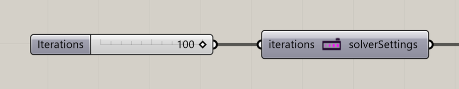

# Nuclei4 Solver Iterations

Limit a simulation to a chosen number of steps.

**Location:** Nuclei4 → Solver



## Use it

Connect **solverSettings** to the solver’s **settings** input. At the limit, the solver stops advancing and can pause its attached Trigger. Raise the limit or reset, then restart the Trigger to continue.

## Inputs

Defaults describe a newly placed component.

| Input | Type / access | Default | Meaning |
| --- | --- | --- | --- |
| **Iterations** (`iterations`) | Integer / item | Optional; 1 | Maximum number of solver steps. |

## Output

| Output | Type / access | Meaning |
| --- | --- | --- |
| **Solver Settings** (`solverSettings`) | Text / list | Iteration limit for the solver. |

## If something is wrong

| Symptom | Action |
| --- | --- |
| The simulation stops after one step | Set Maximum Iterations to the intended limit; a new component defaults to 1. |
| The Trigger stays paused | Restart it after resetting or increasing the limit. |

## Continue

[Gradient Map](../examples/02-gradient-map.md) · [Minimizing Transport Networks 1](../examples/03-minimizing-transport-networks-1.md) · [Minimizing Transport Networks 2](../examples/04-minimizing-transport-networks-2.md) · [Component reference](README.md)

<details>
<summary>Machine-readable reference (JSON)</summary>

Component metadata for scripts and AI tools. Indices are zero-based; defaults are display strings. [Full catalog](../reference/component-contracts.json).

```json
{
  "schemaVersion": 1,
  "pluginVersion": "4.1.0.0",
  "ghaSha256": "700C1620FD839DD1511E67359961787C8EC08EA595812B2EDED27828F96800C5",
  "component": {
    "name": "Nuclei4 Solver Iterations",
    "category": "Nuclei4",
    "subcategory": " Solver",
    "componentGuid": "117cfcd7-ca25-4b01-8d76-688e2661ebb6",
    "dotnetType": "Nuclei4.Iterations",
    "inputs": [
      {
        "index": 0,
        "name": "Iterations",
        "nickname": "iterations",
        "ghType": "Integer",
        "access": "item",
        "optional": true,
        "mapping": "None",
        "defaults": [
          "1"
        ]
      }
    ],
    "outputs": [
      {
        "index": 0,
        "name": "Solver Settings",
        "nickname": "solverSettings",
        "ghType": "Text",
        "access": "list",
        "optional": false,
        "mapping": "None",
        "defaults": []
      }
    ]
  }
}
```

</details>
