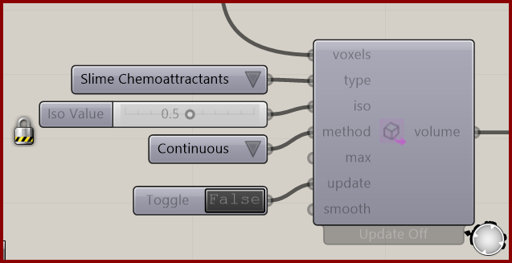

# Nuclei4 to Dendro Volume

Turn a selected scalar field into a Dendro volume, with a Rhino mesh fallback when Dendro is unavailable. Use this after you have a useful simulation state to convert.

**Location:** Nuclei4 → Voxels

*Captured from 15_3D Intro.gh, preserving its component position and connected controls. Example values can differ from the fresh-component defaults below.*

## Use it

Choose the same Type used to preview the field. Set Update True to rebuild, then False to retain the result. Continuous mode uses an isosurface; Discrete mode uses selected cell centers. Maximum Elements limits triangles or selected centers according to the mode. Smoothing and Iso Value affect the resulting form.

## Inputs

| Input | Data | Default | Purpose |
| --- | --- | --- | --- |
| **Voxels** (`voxels`) | Generic Data; item | Supply input | Nuclei4 voxel field |
| **Type** (`type`) | Integer; item | 7 | Type of Voxel Value, matching Voxel Preview |
| **Iso Value** (`iso`) | Number; item | 0.8 | Scalar level used to select the volume |
| **Method** (`method`) | Integer; item | 0 | Continuous uses marching tetrahedra; Discrete uses selected voxel centres as Dendro point kernels |
| **Maximum Elements** (`max`) | Integer; item | 5000000 | Safety limit for triangles in Continuous mode or selected voxel centres in Discrete mode |
| **Update** (`update`) | Boolean; item | False | When true, rebuilds the cached output whenever the component receives updated data |
| **Smoothing Iterations** (`smooth`) | Integer; item | 1 | Volume-smoothing passes used by Continuous mode; 0 disables smoothing |

Defaults describe a newly placed component. A saved definition can store other values on an unconnected input.

## Outputs

| Output | Data | Purpose |
| --- | --- | --- |
| **Dendro Volume / Mesh** (`volume`) | Generic Data; item | Native Dendro volume, or a Rhino mesh when Dendro is unavailable |

## In the example collection

- [15_3D Intro](../examples/15-3d-intro.md)
- [16_Function Voxels](../examples/16-function-voxels.md)

[Back to the component reference](README.md)
