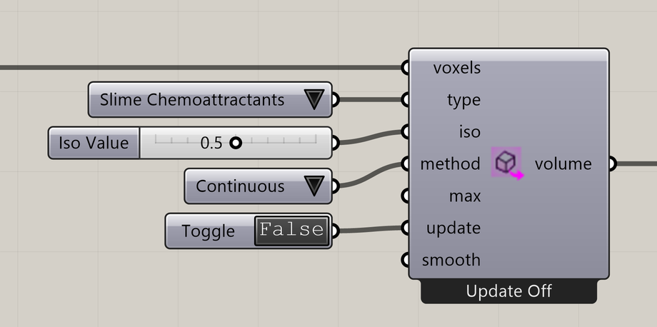

# Nuclei4 to Dendro Volume

Convert a voxel property into a Dendro volume or Rhino mesh.

**Location:** Nuclei4 → Voxels



## Use it

Connect a field, choose **Type**, and set **Iso Value** to select the density level. Turn **Update** on to build the result, then off to hold it while the simulation continues.

## Inputs

Defaults describe a newly placed component.

| Input                               | Type / access       | Default  | Meaning                                                     |
| ----------------------------------- | ------------------- | -------- | ----------------------------------------------------------- |
| **Voxels** (`voxels`)               | Generic Data / item | Required | Voxel field or selection to use.                            |
| **Type** (`type`)                   | Integer / item      | 7        | Property to use; see **Type choices** below.                |
| **Iso Value** (`iso`)               | Number / item       | 0.8      | Value defining the extracted density level.                 |
| **Method** (`method`)               | Integer / item      | 0        | 0: Continuous; 1: Discrete.                                 |
| **Maximum Elements** (`max`)        | Integer / item      | 5000000  | Maximum triangles or selected centers, depending on Method. |
| **Update** (`update`)               | Boolean / item      | False    | True rebuilds the result; False holds the previous result.  |
| **Smoothing Iterations** (`smooth`) | Integer / item      | 1        | Smoothing passes for Continuous mode; 0 disables smoothing. |

### Type choices

| Value | Choice                 |
| ----- | ---------------------- |
| 0     | Minimum Density        |
| 1     | Maximum Density        |
| 2     | Speed                  |
| 3     | Sensor Distance        |
| 4     | Sensor Angle           |
| 5     | Rotation Angle         |
| 6     | Slime Food             |
| 13    | Ant Food               |
| 7     | Slime Chemoattractants |
| 8     | Ant Food Pheromones    |
| 9     | Ant Base Pheromones    |
| 10    | Ant Pheromones         |
| 11    | Ants and Slime         |

### Method choices

| Value | Choice     |
| ----- | ---------- |
| 0     | Continuous |
| 1     | Discrete   |

## Output

| Output                              | Type / access       | Meaning                                                  |
| ----------------------------------- | ------------------- | -------------------------------------------------------- |
| **Dendro Volume / Mesh** (`volume`) | Generic Data / item | Dendro volume, or Rhino mesh when Dendro is unavailable. |

## Conversion methods

**Continuous** creates a surface at the selected value; Smoothing Iterations controls smoothing before extraction. **Discrete** builds Dendro point kernels at selected voxel centers.

When Dendro is unavailable, the component outputs a Rhino mesh. Maximum Elements limits triangles in Continuous mode or selected centers in Discrete mode.

## If something is wrong

| Symptom                              | Action                                                  |
| ------------------------------------ | ------------------------------------------------------- |
| Nothing updates                      | Set Update True.                                        |
| The output is empty                  | Check whether the field reaches the selected Iso Value. |
| Output is a mesh instead of a volume | Check that Dendro is installed and loaded.              |

## Continue

[3D Intro](../examples/15-3d-intro.md) · [Function Voxels](../examples/16-function-voxels.md) · [Component reference](./)

<details>

<summary>Machine-readable reference (JSON)</summary>

[Download JSON](../reference/components/nuclei4-to-dendro-volume.json) · [JSON Schema](../reference/component.schema.json) · [How to read this JSON](../reference/reading-json.md)

Component metadata for scripts and AI tools. Indices are zero-based; defaults are display strings. [Full catalog](../reference/component-contracts.json).

```json
{
  "$schema": "../component.schema.json",
  "schemaVersion": 1,
  "pluginVersion": "4.1.0.0",
  "ghaSha256": "700C1620FD839DD1511E67359961787C8EC08EA595812B2EDED27828F96800C5",
  "component": {
    "name": "Nuclei4 to Dendro Volume",
    "category": "Nuclei4",
    "subcategory": "Voxels",
    "componentGuid": "2cc99696-1f20-4add-82d5-a317c252edb8",
    "dotnetType": "Nuclei4.GpuVolumeToMesh",
    "inputs": [
      {
        "index": 0,
        "name": "Voxels",
        "nickname": "voxels",
        "ghType": "Generic Data",
        "access": "item",
        "optional": false,
        "mapping": "None",
        "defaults": []
      },
      {
        "index": 1,
        "name": "Type",
        "nickname": "type",
        "ghType": "Integer",
        "access": "item",
        "optional": false,
        "mapping": "None",
        "defaults": [
          "7"
        ]
      },
      {
        "index": 2,
        "name": "Iso Value",
        "nickname": "iso",
        "ghType": "Number",
        "access": "item",
        "optional": false,
        "mapping": "None",
        "defaults": [
          "0.8"
        ]
      },
      {
        "index": 3,
        "name": "Method",
        "nickname": "method",
        "ghType": "Integer",
        "access": "item",
        "optional": false,
        "mapping": "None",
        "defaults": [
          "0"
        ]
      },
      {
        "index": 4,
        "name": "Maximum Elements",
        "nickname": "max",
        "ghType": "Integer",
        "access": "item",
        "optional": false,
        "mapping": "None",
        "defaults": [
          "5000000"
        ]
      },
      {
        "index": 5,
        "name": "Update",
        "nickname": "update",
        "ghType": "Boolean",
        "access": "item",
        "optional": false,
        "mapping": "None",
        "defaults": [
          "False"
        ]
      },
      {
        "index": 6,
        "name": "Smoothing Iterations",
        "nickname": "smooth",
        "ghType": "Integer",
        "access": "item",
        "optional": false,
        "mapping": "None",
        "defaults": [
          "1"
        ]
      }
    ],
    "outputs": [
      {
        "index": 0,
        "name": "Dendro Volume / Mesh",
        "nickname": "volume",
        "ghType": "Generic Data",
        "access": "item",
        "optional": false,
        "mapping": "None",
        "defaults": []
      }
    ]
  }
}
```

</details>
