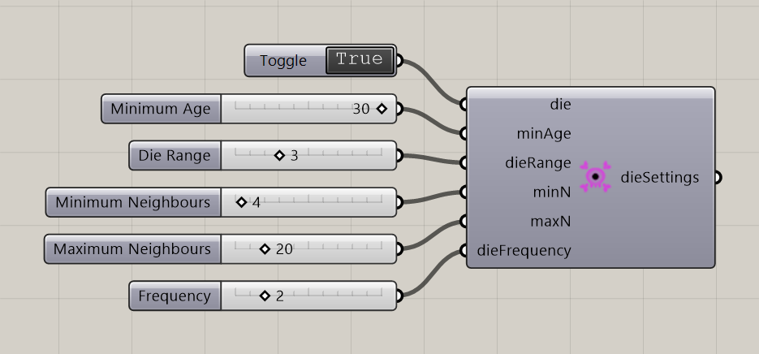

# Particle Death Settings

Configure particle death using age, neighborhood, and update-frequency controls.

**Location:** Nuclei4 → Particles

*Captured from 11_Growth 1.gh, with its connected sliders and primitives arranged beside the component for readability. Example values can differ from the fresh-component defaults below.*

## Use it

Death is disabled by default. Enable Die and connect the settings to the solver. Compare neighbor range, bounds, and frequency with the saved Growth examples; changing several together makes their effects difficult to distinguish.

## Inputs

| Input | Data | Default | Purpose |
| --- | --- | --- | --- |
| **Die** (`die`) | Boolean; item | False | Die Boolean |
| **Minimum Age** (`minAge`) | Integer; item | 10 | Minimum Age Since The Particles Can Start Dying |
| **Die Range** (`dieRange`) | Integer; item | 3 | The Range To Check For Neighbour Particle Count |
| **Minimum Neighbours** (`minN`) | Integer; item | 0 | Minimum Number of Neighbour Particles |
| **Maximum Neighbours** (`maxN`) | Integer; item | 10 | Maximum Number of Neighbour Particles |
| **Frequency** (`dieFrequency`) | Integer; item | 5 | The Particles Die Once Every X Iterations |

Defaults describe a newly placed component. A saved definition can store other values on an unconnected input.

## Outputs

| Output | Data | Purpose |
| --- | --- | --- |
| **Death Settings** (`dieSettings`) | Text; list | Settings Controlling Particle Death |

## In the example collection

- [11_Growth 1](../examples/11-growth-1.md)
- [12_Growth 2](../examples/12-growth-2.md)

[Back to the component reference](README.md)
