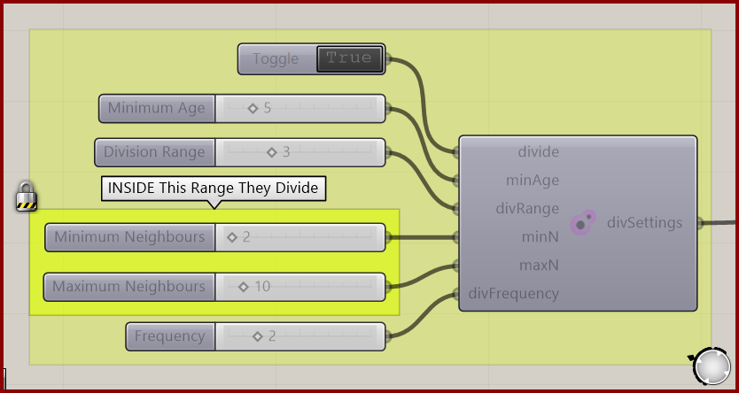

# Particle Division Settings

Configure particle division using age, neighborhood, and update-frequency controls.

**Location:** Nuclei4 → Particles

*Captured from 11_Growth 1.gh, preserving its component position and connected controls. Example values can differ from the fresh-component defaults below.*

## Use it

Division is disabled by default. Enable Divide and connect the settings to the solver. Also inspect population bounds and available space. More division does not guarantee unlimited growth in a crowded field.

## Inputs

| Input | Data | Default | Purpose |
| --- | --- | --- | --- |
| **Divide** (`divide`) | Boolean; item | False | Divide Boolean |
| **Minimum Age** (`minAge`) | Integer; item | 10 | Minimum Age Since The Particles Can Start Dividing |
| **Division Range** (`divRange`) | Integer; item | 3 | The Range To Check For Neighbour Particle Count |
| **Minimum Neighbours** (`minN`) | Integer; item | 0 | Minimum Number of Neighbour Particles |
| **Maximum Neighbours** (`maxN`) | Integer; item | 10 | Maximum Number of Neighbour Particles |
| **Frequency** (`divFrequency`) | Integer; item | 5 | The Particles Divide Once Every X Iterations |

Defaults describe a newly placed component. A saved definition can store other values on an unconnected input.

## Outputs

| Output | Data | Purpose |
| --- | --- | --- |
| **Division Settings** (`divSettings`) | Text; list | Settings Controlling Particle Division |

## In the example collection

- [11_Growth 1](../examples/11-growth-1.md)
- [12_Growth 2](../examples/12-growth-2.md)

[Back to the component reference](README.md)
