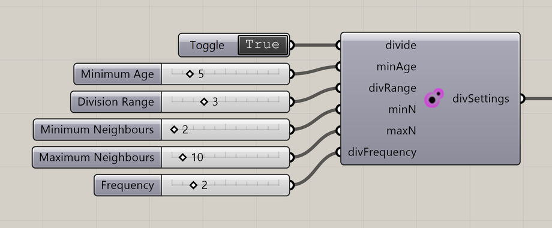

# Particle Division Settings

Allow particles to divide when their age and neighborhood meet the conditions.

**Location:** Nuclei4 → Particles



## Use it

Enable **Divide** and connect **divSettings** to the solver’s **settings** input. Eligible particles divide when their neighbor count is between **Minimum Neighbours** and **Maximum Neighbours**, including both limits. **Frequency** sets how often the rule is checked.

## Inputs

Defaults describe a newly placed component.

| Input | Type / access | Default | Meaning |
| --- | --- | --- | --- |
| **Divide** (`divide`) | Boolean / item | False | Enable neighborhood-based division. |
| **Minimum Age** (`minAge`) | Integer / item | 10 | Minimum particle age, in simulation steps. |
| **Division Range** (`divRange`) | Integer / item | 3 | Neighborhood range used to count particles. |
| **Minimum Neighbours** (`minN`) | Integer / item | 0 | A particle needs at least this many neighbors to divide. |
| **Maximum Neighbours** (`maxN`) | Integer / item | 10 | A particle can divide only if it has no more than this many neighbors. |
| **Frequency** (`divFrequency`) | Integer / item | 5 | Check the division rule every this many simulation steps. |

## Output

| Output | Type / access | Meaning |
| --- | --- | --- |
| **Division Settings** (`divSettings`) | Text / list | Division settings for the solver. |

## If something is wrong

| Symptom | Action |
| --- | --- |
| Population does not grow | Check Divide, Minimum Age, neighbor limits, available space, and population limits. |

## Continue

[Growth 1](../examples/11-growth-1.md) · [Growth 2](../examples/12-growth-2.md) · [Component reference](README.md)

<details>
<summary>Machine-readable reference (JSON)</summary>

Component metadata for scripts and AI tools. Indices are zero-based; defaults are display strings. [Full catalog](../reference/component-contracts.json).

```json
{
  "schemaVersion": 1,
  "pluginVersion": "4.1.0.0",
  "ghaSha256": "700C1620FD839DD1511E67359961787C8EC08EA595812B2EDED27828F96800C5",
  "component": {
    "name": "Particle Division Settings",
    "category": "Nuclei4",
    "subcategory": " Particles",
    "componentGuid": "7e505abb-dc4f-4226-a922-f92e25ab70da",
    "dotnetType": "Nuclei4.Particle_Settings_Division",
    "inputs": [
      {
        "index": 0,
        "name": "Divide",
        "nickname": "divide",
        "ghType": "Boolean",
        "access": "item",
        "optional": false,
        "mapping": "None",
        "defaults": [
          "False"
        ]
      },
      {
        "index": 1,
        "name": "Minimum Age",
        "nickname": "minAge",
        "ghType": "Integer",
        "access": "item",
        "optional": false,
        "mapping": "None",
        "defaults": [
          "10"
        ]
      },
      {
        "index": 2,
        "name": "Division Range",
        "nickname": "divRange",
        "ghType": "Integer",
        "access": "item",
        "optional": false,
        "mapping": "None",
        "defaults": [
          "3"
        ]
      },
      {
        "index": 3,
        "name": "Minimum Neighbours",
        "nickname": "minN",
        "ghType": "Integer",
        "access": "item",
        "optional": false,
        "mapping": "None",
        "defaults": [
          "0"
        ]
      },
      {
        "index": 4,
        "name": "Maximum Neighbours",
        "nickname": "maxN",
        "ghType": "Integer",
        "access": "item",
        "optional": false,
        "mapping": "None",
        "defaults": [
          "10"
        ]
      },
      {
        "index": 5,
        "name": "Frequency",
        "nickname": "divFrequency",
        "ghType": "Integer",
        "access": "item",
        "optional": false,
        "mapping": "None",
        "defaults": [
          "5"
        ]
      }
    ],
    "outputs": [
      {
        "index": 0,
        "name": "Division Settings",
        "nickname": "divSettings",
        "ghType": "Text",
        "access": "list",
        "optional": false,
        "mapping": "None",
        "defaults": []
      }
    ]
  }
}
```

</details>
