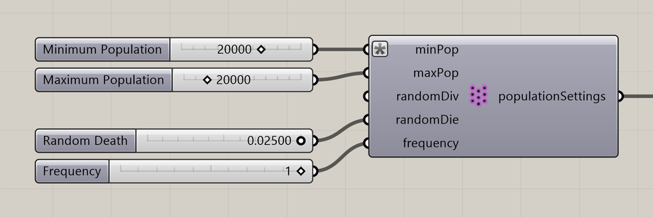

# Particle Population Settings

Set population limits and random division or death.

**Location:** Nuclei4 → Particles



## Use it

Connect **populationSettings** to the solver’s **settings** input. Minimum and Maximum Population bound population changes. Random Division and Random Death are independent probabilities applied at each population update.

These random changes are separate from the neighborhood rules in Particle Division Settings and Particle Death Settings.

## Inputs

Defaults describe a newly placed component.

| Input | Type / access | Default | Meaning |
| --- | --- | --- | --- |
| **Minimum Population** (`minPop`) | Integer / item | Optional; 100 | Minimum population for population changes. |
| **Maximum Population** (`maxPop`) | Integer / item | Optional; 20000 | Maximum population for population changes. |
| **Random Division** (`randomDiv`) | Number / item | Optional; 0 | Independent division probability per update, from 0 to 1. |
| **Random Death** (`randomDie`) | Number / item | Optional; 0 | Independent death probability per update, from 0 to 1. |
| **Frequency** (`frequency`) | Integer / item | Optional; 1 | Steps between random population updates: **1** checks every step; **10** checks every tenth step. Higher values make updates less frequent. |

## Output

| Output | Type / access | Meaning |
| --- | --- | --- |
| **Population Settings** (`populationSettings`) | Text / list | Population settings for the solver. |

## If something is wrong

| Symptom | Action |
| --- | --- |
| Population stays near a limit | Check Minimum and Maximum Population. |
| Changes happen too frequently | Allow more steps between updates by increasing the **Frequency** value, or reduce **Random Division** and **Random Death**. |

## Continue

[Minimizing Transport Networks 1](../examples/03-minimizing-transport-networks-1.md) · [Minimizing Transport Networks 2](../examples/04-minimizing-transport-networks-2.md) · [Growth 1](../examples/11-growth-1.md) · [Component reference](README.md)

<details>
<summary>Machine-readable reference (JSON)</summary>

Component metadata for scripts and AI tools. Indices are zero-based; defaults are display strings. [Full catalog](../reference/component-contracts.json).

```json
{
  "schemaVersion": 1,
  "pluginVersion": "4.1.0.0",
  "ghaSha256": "700C1620FD839DD1511E67359961787C8EC08EA595812B2EDED27828F96800C5",
  "component": {
    "name": "Particle Population Settings",
    "category": "Nuclei4",
    "subcategory": " Particles",
    "componentGuid": "0224814f-9543-481b-9ec0-5f206c39b408",
    "dotnetType": "Nuclei4.Particle_Settings_Population",
    "inputs": [
      {
        "index": 0,
        "name": "Minimum Population",
        "nickname": "minPop",
        "ghType": "Integer",
        "access": "item",
        "optional": true,
        "mapping": "None",
        "defaults": [
          "100"
        ]
      },
      {
        "index": 1,
        "name": "Maximum Population",
        "nickname": "maxPop",
        "ghType": "Integer",
        "access": "item",
        "optional": true,
        "mapping": "None",
        "defaults": [
          "20000"
        ]
      },
      {
        "index": 2,
        "name": "Random Division",
        "nickname": "randomDiv",
        "ghType": "Number",
        "access": "item",
        "optional": true,
        "mapping": "None",
        "defaults": [
          "0"
        ]
      },
      {
        "index": 3,
        "name": "Random Death",
        "nickname": "randomDie",
        "ghType": "Number",
        "access": "item",
        "optional": true,
        "mapping": "None",
        "defaults": [
          "0"
        ]
      },
      {
        "index": 4,
        "name": "Frequency",
        "nickname": "frequency",
        "ghType": "Integer",
        "access": "item",
        "optional": true,
        "mapping": "None",
        "defaults": [
          "1"
        ]
      }
    ],
    "outputs": [
      {
        "index": 0,
        "name": "Population Settings",
        "nickname": "populationSettings",
        "ghType": "Text",
        "access": "list",
        "optional": false,
        "mapping": "None",
        "defaults": []
      }
    ]
  }
}
```

</details>
