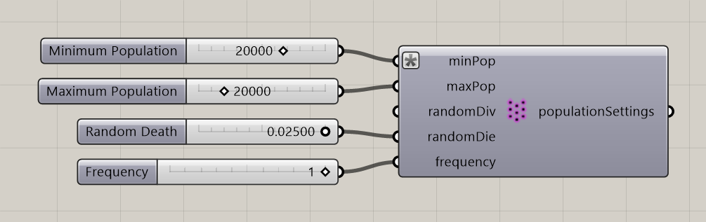

# Particle Population Settings

Set population bounds and independent random division and death probabilities.

**Location:** Nuclei4 → Particles

*Captured from 03_Minimizing Transport Networks 1.gh, with its connected sliders and primitives arranged beside the component for readability. Example values can differ from the fresh-component defaults below.*

## Use it

Connect this settings output to the solver. Random Division and Random Death run at the configured population-update frequency and are distinct from the neighborhood-based division and death controls.

## Inputs

| Input | Data | Default | Purpose |
| --- | --- | --- | --- |
| **Minimum Population** (`minPop`) | Integer; item | 100 | Minimum Population of Particles |
| **Maximum Population** (`maxPop`) | Integer; item | 20000 | Maxiumum Population of Particles |
| **Random Division** (`randomDiv`) | Number; item | 0 | Independent division probability per particle at each population update (0 to 1) |
| **Random Death** (`randomDie`) | Number; item | 0 | Independent removal probability per particle at each population update (0 to 1) |
| **Frequency** (`frequency`) | Integer; item | 1 | Apply random population changes once every X solver iterations |

Defaults describe a newly placed component. A saved definition can store other values on an unconnected input.

## Outputs

| Output | Data | Purpose |
| --- | --- | --- |
| **Population Settings** (`populationSettings`) | Text; list | Settings For Particle Population |

## In the example collection

- [03_Minimizing Transport Networks 1](../examples/03-minimizing-transport-networks-1.md)
- [04_Minimizing Transport Networks 2](../examples/04-minimizing-transport-networks-2.md)
- [11_Growth 1](../examples/11-growth-1.md)

[Back to the component reference](README.md)
