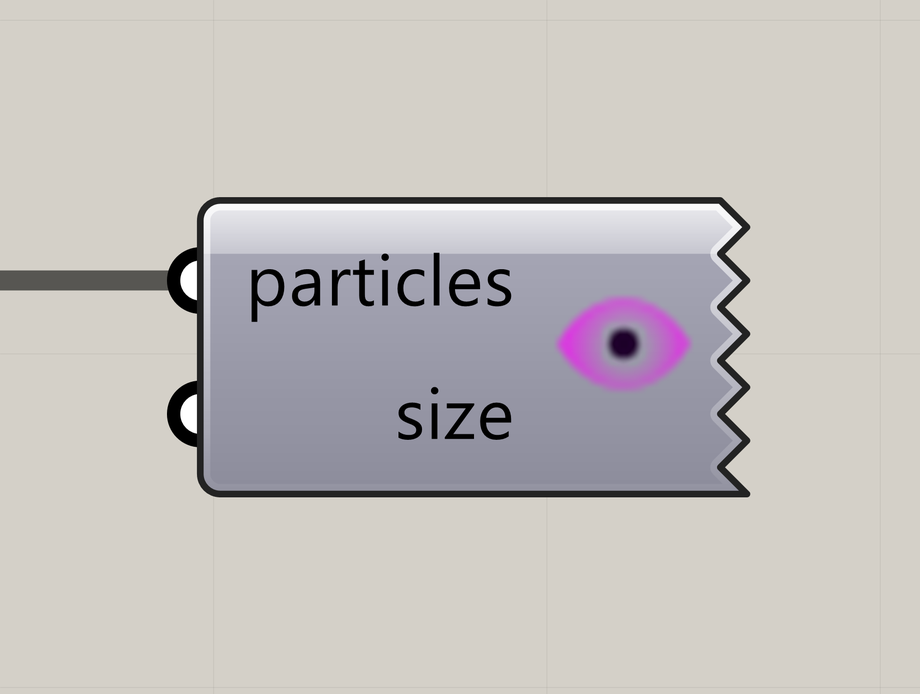

# Particle Preview

Display particles as points in the Rhino viewport.

**Location:** Nuclei4 → Preview



## Use it

Connect the solver’s **particles** output to **particles**. Adjust **size** to change the displayed point size. Particle colors come from their populations.

## Inputs

Defaults describe a newly placed component.

| Input | Type / access | Default | Meaning |
| --- | --- | --- | --- |
| **Particles** (`particles`) | Generic Data / item | Required | Current particle collection from the solver. |
| **Point Size** (`size`) | Number / item | Optional; 2 | Displayed particle point size. |

## Output

Displays directly in the Rhino viewport.

## If something is wrong

| Symptom | Action |
| --- | --- |
| Nothing appears | Enable Grasshopper preview and zoom to the field. |
| Points do not move | Check that the input comes from the running solver. |

## Continue

[Gradient Map](../examples/02-gradient-map.md) · [Minimizing Transport Networks 1](../examples/03-minimizing-transport-networks-1.md) · [Minimizing Transport Networks 2](../examples/04-minimizing-transport-networks-2.md) · [Component reference](README.md)

<details>
<summary>Machine-readable reference (JSON)</summary>

Component metadata for scripts and AI tools. Indices are zero-based; defaults are display strings. [Full catalog](../reference/component-contracts.json).

```json
{
  "schemaVersion": 1,
  "pluginVersion": "4.1.0.0",
  "ghaSha256": "700C1620FD839DD1511E67359961787C8EC08EA595812B2EDED27828F96800C5",
  "component": {
    "name": "Particle Preview",
    "category": "Nuclei4",
    "subcategory": "Preview",
    "componentGuid": "60649521-0784-4a2e-8dfa-27e4a04600ac",
    "dotnetType": "Nuclei4.Preview_Particle",
    "inputs": [
      {
        "index": 0,
        "name": "Particles",
        "nickname": "particles",
        "ghType": "Generic Data",
        "access": "item",
        "optional": false,
        "mapping": "None",
        "defaults": []
      },
      {
        "index": 1,
        "name": "Point Size",
        "nickname": "size",
        "ghType": "Number",
        "access": "item",
        "optional": true,
        "mapping": "None",
        "defaults": [
          "2"
        ]
      }
    ],
    "outputs": []
  }
}
```

</details>
