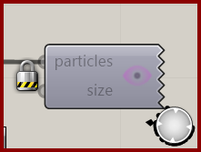

# Particle Preview

Display current particle positions in the Rhino viewport.

**Location:** Nuclei4 → Preview

*Captured from 02_Gradient Map.gh, preserving its component position and connected controls. Example values can differ from the fresh-component defaults below.*

## Use it

Connect the solver’s particles output and adjust Point Size for readability. This preview shows points; use Particle Trail Preview for movement histories.

## Inputs

| Input | Data | Default | Purpose |
| --- | --- | --- | --- |
| **Particles** (`particles`) | Generic Data; item | Supply input | Input Particles |
| **Point Size** (`size`) | Number; item | 2 | Point Display Size |

Defaults describe a newly placed component. A saved definition can store other values on an unconnected input.

## Outputs

This component displays in the Rhino viewport and has no output parameters.

## In the example collection

- [02_Gradient Map](../examples/02-gradient-map.md)
- [03_Minimizing Transport Networks 1](../examples/03-minimizing-transport-networks-1.md)
- [04_Minimizing Transport Networks 2](../examples/04-minimizing-transport-networks-2.md)

[Back to the component reference](README.md)
