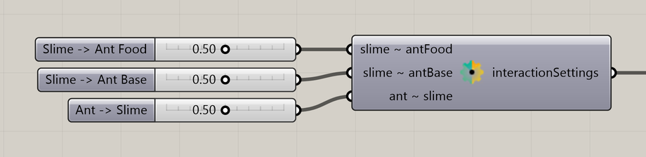

# Particle Settings Slime Ant Interaction

Control how slime and ant populations respond to each other’s signals.

**Location:** Nuclei4 → Particles



## Use it

Connect **interactionSettings** to the solver’s **settings** input in a simulation containing both particle types. The three controls set slime response to ant food pheromones, slime response to base pheromones, and ant response to slime signal.

## Inputs

Defaults describe a newly placed component.

| Input | Type / access | Default | Meaning |
| --- | --- | --- | --- |
| **Slime -> Ant Food** (`slime ~ antFood`) | Number / item | 0.5 | Slime response to ant food pheromones, from 0 to 1. |
| **Slime -> Ant Base** (`slime ~ antBase`) | Number / item | 0.5 | Slime response to ant home pheromones, from 0 to 1. |
| **Ant -> Slime** (`ant ~ slime`) | Number / item | 0.5 | Ant response to slime signal, from 0 to 1. |

## Output

| Output | Type / access | Meaning |
| --- | --- | --- |
| **Interaction Settings** (`interactionSettings`) | Text / list | Slime–ant interaction settings for the solver. |

## If something is wrong

| Symptom | Action |
| --- | --- |
| No visible interaction | Check that both populations and their signals are present. |
| One response dominates | Adjust its interaction value separately. |

## Continue

[Component reference](README.md)

<details>
<summary>Machine-readable reference (JSON)</summary>

Component metadata for scripts and AI tools. Indices are zero-based; defaults are display strings. [Full catalog](../reference/component-contracts.json).

```json
{
  "schemaVersion": 1,
  "pluginVersion": "4.1.0.0",
  "ghaSha256": "700C1620FD839DD1511E67359961787C8EC08EA595812B2EDED27828F96800C5",
  "component": {
    "name": "Particle Settings Slime Ant Interaction",
    "category": "Nuclei4",
    "subcategory": " Particles",
    "componentGuid": "9c28782b-f3db-40e3-8bd7-f099d8b62ae3",
    "dotnetType": "Nuclei4.Particle_Settings_Ant_Slime",
    "inputs": [
      {
        "index": 0,
        "name": "Slime -> Ant Food",
        "nickname": "slime ~ antFood",
        "ghType": "Number",
        "access": "item",
        "optional": false,
        "mapping": "None",
        "defaults": [
          "0.5"
        ]
      },
      {
        "index": 1,
        "name": "Slime -> Ant Base",
        "nickname": "slime ~ antBase",
        "ghType": "Number",
        "access": "item",
        "optional": false,
        "mapping": "None",
        "defaults": [
          "0.5"
        ]
      },
      {
        "index": 2,
        "name": "Ant -> Slime",
        "nickname": "ant ~ slime",
        "ghType": "Number",
        "access": "item",
        "optional": false,
        "mapping": "None",
        "defaults": [
          "0.5"
        ]
      }
    ],
    "outputs": [
      {
        "index": 0,
        "name": "Interaction Settings",
        "nickname": "interactionSettings",
        "ghType": "Text",
        "access": "list",
        "optional": false,
        "mapping": "None",
        "defaults": []
      }
    ]
  }
}
```

</details>
