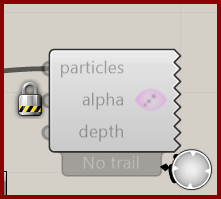

# Particle Trail Preview

Display recent particle paths in the Rhino viewport.

**Location:** Nuclei4 → Preview

*Captured from 01_Slime Intro.gh, preserving its component position and connected controls. Example values can differ from the fresh-component defaults below.*

## Use it

Connect the solver’s particles output and send Particle Trail Settings to the solver. Alpha controls opacity; Depth Focus helps distinguish depth in 3D. A reset state may show No trail until particles have moved.

## Inputs

| Input | Data | Default | Purpose |
| --- | --- | --- | --- |
| **Particles** (`particles`) | Generic Data; item | Supply input | Input Particles |
| **Alpha** (`alpha`) | Number; item | 0.35 | Trail opacity multiplier |
| **Depth Focus** (`depth`) | Number; item | 0.55 | Camera-depth fading for 3D trail readability. 0 disables it, 1 is strongest. |

Defaults describe a newly placed component. A saved definition can store other values on an unconnected input.

## Outputs

This component displays in the Rhino viewport and has no output parameters.

## In the example collection

- [01_Slime Intro](../examples/01-slime-intro.md)
- [02_Gradient Map](../examples/02-gradient-map.md)
- [03_Minimizing Transport Networks 1](../examples/03-minimizing-transport-networks-1.md)

[Back to the component reference](README.md)
