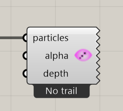

# Particle Trail Preview

Display each particle’s recent path in the Rhino viewport.

**Location:** Nuclei4 → Preview



## Use it

Connect the solver’s **particles** output and provide [Particle Trail Settings](particle-trail-settings.md) to the solver. Advance the simulation to build trails.

**Alpha** controls opacity. **Depth Focus** fades trails by camera depth to make 3D views easier to read.

## Inputs

Defaults describe a newly placed component.

| Input | Type / access | Default | Meaning |
| --- | --- | --- | --- |
| **Particles** (`particles`) | Generic Data / item | Required | Current particle collection from the solver. |
| **Alpha** (`alpha`) | Number / item | Optional; 0.35 | Trail opacity multiplier. |
| **Depth Focus** (`depth`) | Number / item | Optional; 0.55 | Camera-depth fading: 0 disables it; 1 gives the strongest effect. |

## Output

Displays directly in the Rhino viewport.

## If something is wrong

| Symptom | Action |
| --- | --- |
| No trail | Check Trail Size and advance after reset. |
| Trails are hard to see | Check Alpha, Depth Focus, and Grasshopper preview. |

## Continue

[Slime Intro](../examples/01-slime-intro.md) · [Gradient Map](../examples/02-gradient-map.md) · [Minimizing Transport Networks 1](../examples/03-minimizing-transport-networks-1.md) · [Component reference](README.md)

<details>
<summary>Machine-readable reference (JSON)</summary>

[Download JSON](../reference/components/particle-trail-preview.json) · [JSON Schema](../reference/component.schema.json) · [How to read this JSON](../reference/reading-json.md)

Component metadata for scripts and AI tools. Indices are zero-based; defaults are display strings. [Full catalog](../reference/component-contracts.json).

```json
{
  "$schema": "../component.schema.json",
  "schemaVersion": 1,
  "pluginVersion": "4.1.0.0",
  "ghaSha256": "700C1620FD839DD1511E67359961787C8EC08EA595812B2EDED27828F96800C5",
  "component": {
    "name": "Particle Trail Preview",
    "category": "Nuclei4",
    "subcategory": "Preview",
    "componentGuid": "b17ecf97-0425-4ae2-a6b0-b3f869a5bc72",
    "dotnetType": "Nuclei4.Preview_Particle_Trails_GPU",
    "inputs": [
      {
        "index": 0,
        "name": "Particles",
        "nickname": "particles",
        "ghType": "Generic Data",
        "access": "item",
        "optional": false,
        "mapping": "None",
        "defaults": []
      },
      {
        "index": 1,
        "name": "Alpha",
        "nickname": "alpha",
        "ghType": "Number",
        "access": "item",
        "optional": true,
        "mapping": "None",
        "defaults": [
          "0.35"
        ]
      },
      {
        "index": 2,
        "name": "Depth Focus",
        "nickname": "depth",
        "ghType": "Number",
        "access": "item",
        "optional": true,
        "mapping": "None",
        "defaults": [
          "0.55"
        ]
      }
    ],
    "outputs": []
  }
}
```

</details>
