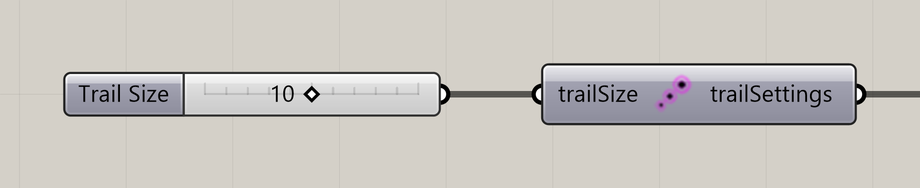

# Particle Trail Settings

Set the number of recent positions retained in each particle trail.

**Location:** Nuclei4 → Particles



## Use it

Connect **trailSettings** to the solver’s **settings** input. Connect the solver’s **particles** output to [Particle Trail Preview](particle-trail-preview.md) for display or [Extract Particle Trails](extract-particle-trails.md) for points.

Trail Size controls movement history. It does not change the deposited signal’s diffusion or decay.

## Inputs

Defaults describe a newly placed component.

| Input                        | Type / access  | Default     | Meaning                                                |
| ---------------------------- | -------------- | ----------- | ------------------------------------------------------ |
| **Trail Size** (`trailSize`) | Integer / item | Optional; 5 | Maximum number of recent positions retained per trail. |

## Output

| Output                               | Type / access | Meaning                                |
| ------------------------------------ | ------------- | -------------------------------------- |
| **Trail Settings** (`trailSettings`) | Text / list   | Trail history settings for the solver. |

## If something is wrong

| Symptom              | Action                                   |
| -------------------- | ---------------------------------------- |
| No trail after reset | Advance the simulation to build history. |
| Trails are too short | Increase Trail Size.                     |

## Continue

[Slime Intro](../examples/01-slime-intro.md) · [Gradient Map](../examples/02-gradient-map.md) · [Minimizing Transport Networks 1](../examples/03-minimizing-transport-networks-1.md) · [Component reference](./)

<details>

<summary>Machine-readable reference (JSON)</summary>

[Download JSON](../reference/components/particle-trail-settings.json) · [JSON Schema](../reference/component.schema.json) · [How to read this JSON](../reference/reading-json.md)

Component metadata for scripts and AI tools. Indices are zero-based; defaults are display strings. [Full catalog](../reference/component-contracts.json).

```json
{
  "$schema": "../component.schema.json",
  "schemaVersion": 1,
  "pluginVersion": "4.1.0.0",
  "ghaSha256": "700C1620FD839DD1511E67359961787C8EC08EA595812B2EDED27828F96800C5",
  "component": {
    "name": "Particle Trail Settings",
    "category": "Nuclei4",
    "subcategory": " Particles",
    "componentGuid": "cd0bb03c-2b66-4dbb-864e-02015f0255e7",
    "dotnetType": "Nuclei4.Particle_Settings_Trail",
    "inputs": [
      {
        "index": 0,
        "name": "Trail Size",
        "nickname": "trailSize",
        "ghType": "Integer",
        "access": "item",
        "optional": true,
        "mapping": "None",
        "defaults": [
          "5"
        ]
      }
    ],
    "outputs": [
      {
        "index": 0,
        "name": "Trail Settings",
        "nickname": "trailSettings",
        "ghType": "Text",
        "access": "list",
        "optional": false,
        "mapping": "None",
        "defaults": []
      }
    ]
  }
}
```

</details>
