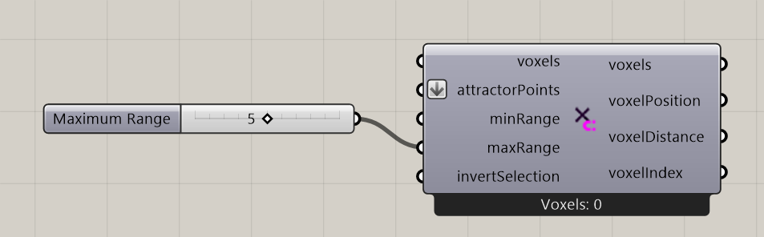

# Point Attractor for Voxels

Select voxels within a distance band around points.

**Location:** Nuclei4 → Environment

*Captured from 03_Minimizing Transport Networks 1.gh, with its connected sliders and primitives arranged beside the component for readability. Example values can differ from the fresh-component defaults below.*

## Use it

Use point neighborhoods as local mapped regions, such as food-source areas. Selection alone does not create food: connect Define Voxel Values and choose Slime Food or Ant Food. Invert Selection reverses which input cells are retained.

## Inputs

| Input | Data | Default | Purpose |
| --- | --- | --- | --- |
| **Voxels** (`voxels`) | Generic Data; item | Supply input | Connects to Voxel Constructor |
| **Attractor Points** (`attractorPoints`) | Point; list | Supply input | Attractor Points |
| **Minimum Range** (`minRange`) | Number; item | 0 | Minimum distance in model units. Supplied reversed ranges are sorted. Thin walls retain neighboring voxels bracketing the wall; rasterized centers can extend beyond the requested interval. |
| **Maximum Range** (`maxRange`) | Number; item | 1 | Maximum distance in model units. An omitted maximum grows from minRange if needed. Range width is at least one voxel size; thin walls additionally retain bracketing voxel pairs for at least two neighboring layers total, subject to available input voxels. |
| **Invert Voxel Selection** (`invertSelection`) | Boolean; item | False | Inverts the Voxel Selection |

Defaults describe a newly placed component. A saved definition can store other values on an unconnected input.

## Outputs

| Output | Data | Purpose |
| --- | --- | --- |
| **Output Voxels** (`voxels`) | Generic Data; item | Output Voxels |
| **Output Voxel Positions** (`voxelPosition`) | Point; list | Output Voxel Positions |
| **Output Distances to Voxels** (`voxelDistance`) | Number; list | Output Distances from Attractor to Voxel |
| **Output Voxel Indices** (`voxelIndex`) | Integer; list | Output Voxel Indices for Sorting |

## In the example collection

- [03_Minimizing Transport Networks 1](../examples/03-minimizing-transport-networks-1.md)
- [04_Minimizing Transport Networks 2](../examples/04-minimizing-transport-networks-2.md)
- [08_Vector Fields 1](../examples/08-vector-fields-1.md)

[Back to the component reference](README.md)
