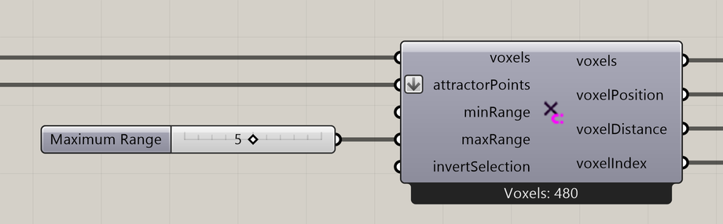

# Point Attractor for Voxels

Select voxels around one or more points.

**Location:** Nuclei4 → Environment



## Use it

Connect a field to **voxels** and points to **attractorPoints**. Set the minimum and maximum distances from the points to select voxels.

Connect the selected **voxels** to [Define Voxel Values](define-voxel-values.md) to assign food, density, or another property.

## Inputs

Defaults describe a newly placed component.

| Input                                          | Type / access       | Default  | Meaning                                              |
| ---------------------------------------------- | ------------------- | -------- | ---------------------------------------------------- |
| **Voxels** (`voxels`)                          | Generic Data / item | Required | Voxel field or selection to use.                     |
| **Attractor Points** (`attractorPoints`)       | Point / list        | Required | Points defining the selected regions.                |
| **Minimum Range** (`minRange`)                 | Number / item       | 0        | Minimum distance from the attractor, in model units. |
| **Maximum Range** (`maxRange`)                 | Number / item       | 1        | Maximum distance from the attractor, in model units. |
| **Invert Voxel Selection** (`invertSelection`) | Boolean / item      | False    | Keep the other cells of the input field instead.     |

## Outputs

| Output                                           | Type / access       | Meaning                                                          |
| ------------------------------------------------ | ------------------- | ---------------------------------------------------------------- |
| **Output Voxels** (`voxels`)                     | Generic Data / item | Selected or modified voxel field.                                |
| **Output Voxel Positions** (`voxelPosition`)     | Point / tree        | Centers of the selected voxels.                                  |
| **Output Distances to Voxels** (`voxelDistance`) | Number / tree       | Distances paired with the selected voxel centers.                |
| **Output Voxel Indices** (`voxelIndex`)          | Integer / tree      | Indices of the selected voxels, paired with the position output. |

## Distance and resolution

**Minimum Range** and **Maximum Range** set how close to and how far from the points voxels are selected, measured in Rhino model units. The selection follows the voxel resolution, so its boundary may extend beyond the exact requested distance. **Invert Voxel Selection** keeps the other input cells.

Position, distance, and index outputs use matching branches. Keep them together when assigning values from the distances.

## If something is wrong

| Symptom                          | Action                                                                                                         |
| -------------------------------- | -------------------------------------------------------------------------------------------------------------- |
| No selected voxels               | Check the point locations and whether the minimum and maximum distances include any voxels in the input field. |
| Selection is wider than expected | Thin selections follow the voxel resolution; use the field size when judging the boundary.                     |

## Continue

[Minimizing Transport Networks 1](../examples/03-minimizing-transport-networks-1.md) · [Minimizing Transport Networks 2](../examples/04-minimizing-transport-networks-2.md) · [Vector Fields 1](../examples/08-vector-fields-1.md) · [Component reference](./)

<details>

<summary>Machine-readable reference (JSON)</summary>

[Download JSON](../reference/components/point-attractor-for-voxels.json) · [JSON Schema](../reference/component.schema.json) · [How to read this JSON](../reference/reading-json.md)

Component metadata for scripts and AI tools. Indices are zero-based; defaults are display strings. [Full catalog](../reference/component-contracts.json).

```json
{
  "$schema": "../component.schema.json",
  "schemaVersion": 1,
  "pluginVersion": "4.1.0.0",
  "ghaSha256": "700C1620FD839DD1511E67359961787C8EC08EA595812B2EDED27828F96800C5",
  "component": {
    "name": "Point Attractor for Voxels",
    "category": "Nuclei4",
    "subcategory": " Environment",
    "componentGuid": "a0ac8ea3-c26e-4852-8e48-e507d0cc6132",
    "dotnetType": "Nuclei4.Voxel_Attractor_Point",
    "inputs": [
      {
        "index": 0,
        "name": "Voxels",
        "nickname": "voxels",
        "ghType": "Generic Data",
        "access": "item",
        "optional": false,
        "mapping": "None",
        "defaults": []
      },
      {
        "index": 1,
        "name": "Attractor Points",
        "nickname": "attractorPoints",
        "ghType": "Point",
        "access": "list",
        "optional": false,
        "mapping": "Flatten",
        "defaults": []
      },
      {
        "index": 2,
        "name": "Minimum Range",
        "nickname": "minRange",
        "ghType": "Number",
        "access": "item",
        "optional": false,
        "mapping": "None",
        "defaults": [
          "0"
        ]
      },
      {
        "index": 3,
        "name": "Maximum Range",
        "nickname": "maxRange",
        "ghType": "Number",
        "access": "item",
        "optional": false,
        "mapping": "None",
        "defaults": [
          "1"
        ]
      },
      {
        "index": 4,
        "name": "Invert Voxel Selection",
        "nickname": "invertSelection",
        "ghType": "Boolean",
        "access": "item",
        "optional": false,
        "mapping": "None",
        "defaults": [
          "False"
        ]
      }
    ],
    "outputs": [
      {
        "index": 0,
        "name": "Output Voxels",
        "nickname": "voxels",
        "ghType": "Generic Data",
        "access": "item",
        "optional": false,
        "mapping": "None",
        "defaults": []
      },
      {
        "index": 1,
        "name": "Output Voxel Positions",
        "nickname": "voxelPosition",
        "ghType": "Point",
        "access": "list",
        "optional": false,
        "mapping": "None",
        "defaults": []
      },
      {
        "index": 2,
        "name": "Output Distances to Voxels",
        "nickname": "voxelDistance",
        "ghType": "Number",
        "access": "list",
        "optional": false,
        "mapping": "None",
        "defaults": []
      },
      {
        "index": 3,
        "name": "Output Voxel Indices",
        "nickname": "voxelIndex",
        "ghType": "Integer",
        "access": "list",
        "optional": false,
        "mapping": "None",
        "defaults": []
      }
    ]
  }
}
```

</details>
