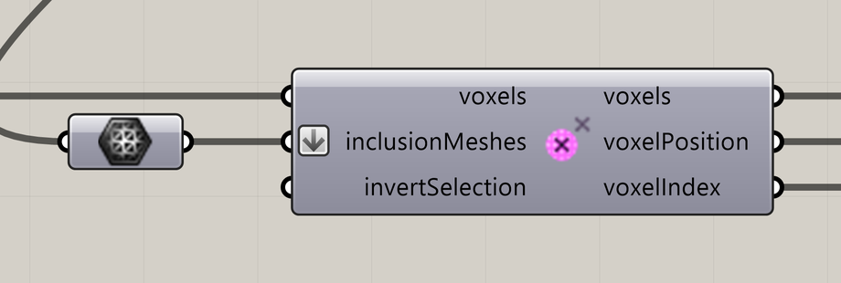

# Voxel Inclusion in Mesh

Select voxels inside meshes.

**Location:** Nuclei4 → Environment



## Use it

Connect a field and closed meshes. The **voxels** output contains the selected region; use it for mapping or particle generation. Turn on **Invert Voxel Selection** to keep the region outside the meshes.

## Inputs

Defaults describe a newly placed component.

| Input | Type / access | Default | Meaning |
| --- | --- | --- | --- |
| **Voxels** (`voxels`) | Generic Data / item | Required | Voxel field or selection to use. |
| **Inclusion Meshes** (`inclusionMeshes`) | Mesh / list | Required | Closed meshes enclosing the selected cells. |
| **Invert Voxel Selection** (`invertSelection`) | Boolean / item | False | Keep the other cells of the input field instead. |

## Outputs

| Output | Type / access | Meaning |
| --- | --- | --- |
| **Output Voxels** (`voxels`) | Generic Data / item | Selected or modified voxel field. |
| **Output Voxel Positions** (`voxelPosition`) | Point / tree | Centers of the selected voxels. |
| **Output Voxel Indices** (`voxelIndex`) | Integer / tree | Indices of the selected voxels, paired with the position output. |

## Selection outputs

Position and index outputs share the same branches. Each branch corresponds to the first mesh containing those voxels. With inverted selection, the outside voxels share one branch.

## If something is wrong

| Symptom | Action |
| --- | --- |
| Interior is missing or unexpected | Check that the meshes are closed and valid. |
| Points and indices do not line up | Keep matching output branches together. |

## Continue

[Minimizing Transport Networks 1](../examples/03-minimizing-transport-networks-1.md) · [Minimizing Transport Networks 2](../examples/04-minimizing-transport-networks-2.md) · [Component reference](README.md)

<details>
<summary>Machine-readable reference (JSON)</summary>

[Download JSON](../reference/components/voxel-inclusion-in-mesh.json) · [JSON Schema](../reference/component.schema.json) · [How to read this JSON](../reference/reading-json.md)

Component metadata for scripts and AI tools. Indices are zero-based; defaults are display strings. [Full catalog](../reference/component-contracts.json).

```json
{
  "$schema": "../component.schema.json",
  "schemaVersion": 1,
  "pluginVersion": "4.1.0.0",
  "ghaSha256": "700C1620FD839DD1511E67359961787C8EC08EA595812B2EDED27828F96800C5",
  "component": {
    "name": "Voxel Inclusion in Mesh",
    "category": "Nuclei4",
    "subcategory": " Environment",
    "componentGuid": "74684ab4-cbf5-4cc1-a75a-4253eb83599b",
    "dotnetType": "Nuclei4.Voxel_MeshInclusion",
    "inputs": [
      {
        "index": 0,
        "name": "Voxels",
        "nickname": "voxels",
        "ghType": "Generic Data",
        "access": "item",
        "optional": false,
        "mapping": "None",
        "defaults": []
      },
      {
        "index": 1,
        "name": "Inclusion Meshes",
        "nickname": "inclusionMeshes",
        "ghType": "Mesh",
        "access": "list",
        "optional": false,
        "mapping": "Flatten",
        "defaults": []
      },
      {
        "index": 2,
        "name": "Invert Voxel Selection",
        "nickname": "invertSelection",
        "ghType": "Boolean",
        "access": "item",
        "optional": false,
        "mapping": "None",
        "defaults": [
          "False"
        ]
      }
    ],
    "outputs": [
      {
        "index": 0,
        "name": "Output Voxels",
        "nickname": "voxels",
        "ghType": "Generic Data",
        "access": "item",
        "optional": false,
        "mapping": "None",
        "defaults": []
      },
      {
        "index": 1,
        "name": "Output Voxel Positions",
        "nickname": "voxelPosition",
        "ghType": "Point",
        "access": "list",
        "optional": false,
        "mapping": "None",
        "defaults": []
      },
      {
        "index": 2,
        "name": "Output Voxel Indices",
        "nickname": "voxelIndex",
        "ghType": "Integer",
        "access": "list",
        "optional": false,
        "mapping": "None",
        "defaults": []
      }
    ]
  }
}
```

</details>
