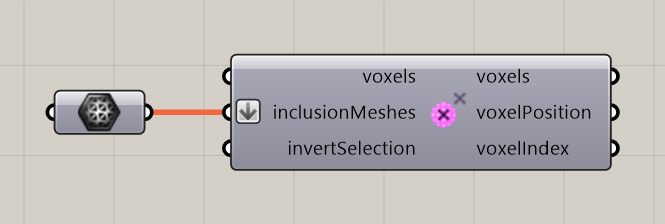

# Voxel Inclusion in Mesh

Select cells according to whether their centers are inside a mesh.

**Location:** Nuclei4 → Environment

*Captured from 03_Minimizing Transport Networks 1.gh, with its connected sliders and primitives arranged beside the component for readability. Example values can differ from the fresh-component defaults below.*

## Use it

Use a suitable closed mesh for an unambiguous interior. Invert Selection switches to the opposite region. This is a center-in-mesh test, not a distance band around the surface.

## Inputs

| Input | Data | Default | Purpose |
| --- | --- | --- | --- |
| **Voxels** (`voxels`) | Generic Data; item | Supply input | Connects to Voxel Constructor |
| **Inclusion Meshes** (`inclusionMeshes`) | Mesh; list | Supply input | Inclusion Meshes |
| **Invert Voxel Selection** (`invertSelection`) | Boolean; item | False | Inverts the Voxel Selection |

Defaults describe a newly placed component. A saved definition can store other values on an unconnected input.

## Outputs

| Output | Data | Purpose |
| --- | --- | --- |
| **Output Voxels** (`voxels`) | Generic Data; item | Output Voxels |
| **Output Voxel Positions** (`voxelPosition`) | Point; list | Selected centers grouped by first containing mesh; computed only when connected |
| **Output Voxel Indices** (`voxelIndex`) | Integer; list | Zero-based selected-voxel ordinals, matching voxelPosition branches; computed only when connected |

## In the example collection

- [03_Minimizing Transport Networks 1](../examples/03-minimizing-transport-networks-1.md)
- [04_Minimizing Transport Networks 2](../examples/04-minimizing-transport-networks-2.md)

[Back to the component reference](README.md)
