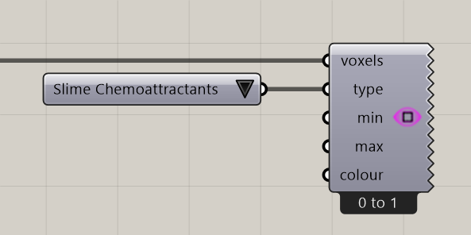

# Voxel Preview

Display a chosen voxel property or simulation signal in Rhino.

**Location:** Nuclei4 → Preview

## Use it

Select the Type you want to inspect and set minimum/maximum thresholds. Connect the solver’s voxels output for evolving signals, or the mapping output to inspect initial conditions. This component displays the field and has no geometry output.

## Inputs

| Input | Data | Default | Purpose |
| --- | --- | --- | --- |
| **Voxels** (`voxels`) | Generic Data; item | Supply input | Connects to Voxel Constructor |
| **Type** (`type`) | Integer; item | 0 | Type of Voxel Value |
| **Minimum Treshold** (`min`) | Number; item | 0 | Minimum Voxel Value for Preview |
| **Maximum Treshold** (`max`) | Number; item | 1 | Maximum Voxel Value for Preview |
| **Colour** (`colour`) | Colour; item | 0,0,0 (0) | The Display Colour of Voxel Values |

Defaults describe a newly placed component. A saved definition can store other values on an unconnected input.

## Outputs

This component displays in the Rhino viewport and has no output parameters.

## In the example collection

- [02_Gradient Map](../examples/02-gradient-map.md)
- [03_Minimizing Transport Networks 1](../examples/03-minimizing-transport-networks-1.md)
- [04_Minimizing Transport Networks 2](../examples/04-minimizing-transport-networks-2.md)

[Back to the component reference](README.md)
